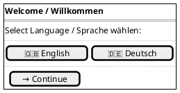
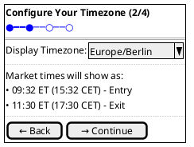
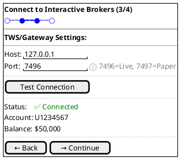
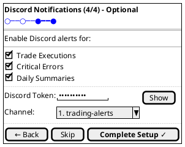
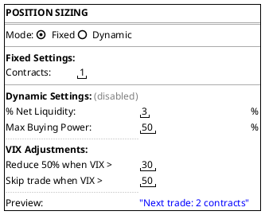
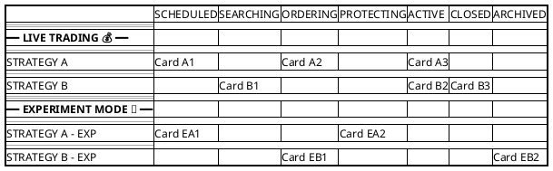
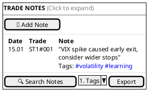

# TODO-UX: UI/UX Specification Ergänzungen

## Übersicht
Dieses Dokument trackt alle notwendigen Ergänzungen zur UI/UX-Spezifikation basierend auf der PRD-Analyse vom 24.01.2025.


## Status-Legende
- ⬜ **TODO** - Noch nicht begonnen
- 🟨 **IN PROGRESS** - In Bearbeitung
- ✅ **DONE** - Abgeschlossen
- 🔍 **REVIEW** - Review erforderlich


## Epic 3: Professional UI, Analytics & Persistence

### ✅ Task 3.1: Analytics Dashboard Section
**Status:** DONE (24.01.2025)  
**Beschreibung:** Ergänze Analytics-Bereich oberhalb der Kanban-Swimlanes

**Overall Statistics (Portfolio-Metriken):**

**Hinweis zur UI-Implementierung:** Die Statistiken sollen als horizontale Kacheln-Reihen dargestellt werden (siehe Screenshot), nicht vertikal. Jede Kachel hat einen Titel oben und den Wert prominent darunter. Farben: Grün für positive Werte, Rot für negative Werte.

```plantuml
@startsalt
{+
    {
        <b>OVERALL STATISTICS</b> <color:gray>(All Active Strategies)</color>
    }
    ==
    {T
        | P/L | CAGR | Max Drawdown | MAR Ratio | Win %
        | <color:green><b>$22,282</b></color> | <b>5.7%</b> | <color:red><b>-1.5%</b></color> | <b>3.9</b> | <b>83.6%</b>
    }
    --
    {T
        | Total Premium | Capture Rate | Starting Capital | Ending Capital | .
        | <b>$287,330</b> | <b>7.8%</b> | <b>$100,000</b> | <color:green><b>$122,282</b></color> | .
    }
    --
    {T
        | Avg Per Trade | Avg Winner | Avg Loser | Max Winner | Max Loser
        | <b>$28</b>/lot | <color:green><b>$90</b></color>/lot | <color:red><b>-$292</b></color>/lot | <color:green><b>$346</b></color>/lot | <color:red><b>-$1,199</b></color>/lot
    }
    --
    {T
        | Avg Minutes | Trades | Winners/Losers | . | .
        | <b>59.1</b> | <b>807</b> | <b>675</b> / <b>132</b> | . | .
    }
}
@endsalt
```



**Alternative visuelle Darstellung (Kachel-Layout):**
```
┌────────────────────────────────────────────────────────────────┐
│                 OVERALL STATISTICS (All Active Strategies)      │
├────────────┬────────────┬────────────┬────────────┬────────────┤
│    P/L     │    CAGR    │ Max Drawdn │  MAR Ratio │   Win %    │
│  $22,282   │    5.7%    │   -1.5%    │     3.9    │   83.6%    │
├────────────┼────────────┼────────────┼────────────┼────────────┤
│Total Prem. │ Capt. Rate │ Start Cap. │  End Cap.  │            │
│  $287,330  │    7.8%    │  $100,000  │  $122,282  │            │
├────────────┼────────────┼────────────┼────────────┼────────────┤
│ Avg/Trade  │ Avg Winner │ Avg Loser  │ Max Winner │ Max Loser  │
│   $28/lot  │   $90/lot  │  -$292/lot │  $346/lot  │-$1,199/lot │
├────────────┼────────────┼────────────┼────────────┼────────────┤
│  Avg Min   │   Trades   │  Win/Loss  │            │            │
│    59.1    │     807    │   675/132  │            │            │
└────────────┴────────────┴────────────┴────────────┴────────────┘
```

**Hinweis:** Metriken aktualisieren sich automatisch nach jedem geschlossenen Trade (innerhalb von <100ms laut PRD)

**Per-Strategy Statistics (Einzelstrategie-Metriken):**

```plantuml
@startsalt
{+
    {
        <b>SPX IRON CONDOR 0DTE</b> <color:gray>(SPXIC)</color>
    }
    ==
    {T
        | <b>P/L</b> | <b>CAGR</b> | <b>Max DD</b> | <b>MAR</b> | <b>Win %</b> | <b>Avg Min</b> | <b>Trades</b> | <b>Winners</b> | <b>Losers</b>
        | <color:green><b>$12,450</b></color> | <b>6.2%</b> | <color:red><b>-1.2%</b></color> | <b>5.2</b> | <b>84.5%</b> | <b>42.3</b> | <b>523</b> | <b>442</b> | <b>81</b>
    }
}
@endsalt
```

```plantuml
@startsalt
{+
    {
        <b>SPY STRANGLE WEEKLY</b> <color:gray>(SPYST)</color>
    }
    ==
    {T
        | <b>P/L</b> | <b>CAGR</b> | <b>Max DD</b> | <b>MAR</b> | <b>Win %</b> | <b>Avg Min</b> | <b>Trades</b> | <b>Winners</b> | <b>Losers</b>
        | <color:green><b>$9,832</b></color> | <b>4.9%</b> | <color:red><b>-1.8%</b></color> | <b>2.7</b> | <b>81.2%</b> | <b>312.5</b> | <b>284</b> | <b>233</b> | <b>51</b>
    }
}
@endsalt
```




**CRITICAL UPDATE REQUIREMENT (FR27 - neu in PRD):** 
- Metriken MÜSSEN innerhalb von 100ms nach Trade-Abschluss (State→CLOSED) aktualisiert werden
- Portfolio-Metriken aktualisieren sich SOFORT nach Änderungen der Einzelstrategie-Metriken
- Updates erfolgen event-gesteuert via State-Change, nicht durch Polling
- Alle verbundenen Clients erhalten Updates via Server-Sent Events

**Metriken zu implementieren (aus PRD Epic 3):**
**Portfolio-Metriken (Overall Statistics):**
- [ ] P/L ($): Absoluter Gewinn/Verlust in Dollar
- [ ] CAGR (%): Compound Annual Growth Rate
- [ ] Max. Drawdown (%): Maximaler Wertverlust vom Höchststand
- [ ] MAR Ratio: CAGR / Max. Drawdown
- [ ] Win Percentage (%): Prozentsatz profitabler Trades
- [ ] Total Premium: Gesamtsumme aller eingenommenen Prämien
- [ ] Capture Rate: P/L als % der Total Premium
- [ ] Starting/Ending Capital: Anfangs- und Endkapital
- [ ] Avg Per Trade/Winner/Loser: Durchschnittswerte
- [ ] Max Winner/Loser: Extreme Werte
- [ ] Avg Minutes in Trade: Durchschnittliche Haltedauer
- [ ] # Trades/Winners/Losers: Anzahl der Trades

**Einzelstrategie-Metriken:**
- [ ] P/L ($): Strategie-spezifischer Gewinn/Verlust
- [ ] CAGR (%): Strategie-spezifische annualisierte Rendite
- [ ] Max. Drawdown (%): Strategie-spezifischer Max DD
- [ ] MAR Ratio: Strategie-spezifisches Risk-adjusted Return
- [ ] Win Percentage (%): Strategie-spezifische Gewinnrate
- [ ] Avg Minutes in Trade: Strategie-spezifische Haltedauer
- [ ] # Trades: Gesamtzahl der Trades dieser Strategie
- [ ] # Winners: Anzahl profitabler Trades
- [ ] # Losers: Anzahl verlustbringender Trades

### ⬜ Task 3.2: Trade Log mit CSV Export 
**Status:** TODO  
**Beschreibung:** Trade Log Tabelle mit Export-Funktionalität (PRD Zeile 521: FR15)

**Features:**
- [ ] Sortierbare/filterbare Tabelle mit Trade History
- [ ] CSV Export Button für Trade-Daten
- [ ] Datumsbereich-Filter
- [ ] Spalten: Trade ID, Strategy, Entry Time, Exit Time, P/L, Status
- [ ] Download als CSV-Datei

---

## Epic 4: Setup Wizard & Localization

### ⬜ Task 4.1: 4-Screen Setup Wizard
**Status:** TODO  
**Beschreibung:** Erstelle vollständigen Onboarding-Flow

**Screen 1: Language Selection**


**Screen 2: Timezone Configuration**


**Screen 3: TWS Connection Test**


**Screen 4: Discord Integration (Optional)**


**Deliverables:**
- [ ] Progress Bar Component
- [ ] Form Validation per Screen
- [ ] Skip-Logic Implementation
- [ ] Success/Error States
- [ ] Auto-launch Browser Logic

---

## Epic 6: Dynamic Position Sizing

### ⬜ Task 6.1: Position Sizing Settings UI
**Status:** TODO  
**Beschreibung:** Erweitere Settings Panel um Dynamic Sizing

**UI-Erweiterung für Settings:**


**Features:**
- [ ] Mode Toggle mit Animation
- [ ] Live Preview Berechnung
- [ ] VIX Current Value Display
- [ ] Validation Warnings
- [ ] Help Tooltips

---

## Epic 7: Complete Experiment Mode

### ⬜ Task 7.1: Experiment Mode Swimlanes
**Status:** TODO  
**Beschreibung:** Definiere getrennte LIVE/EXPERIMENT Bereiche

**Kanban Layout mit Swimlanes:**


**Features:**
- [ ] Visual Separation (Hintergrundfarbe)
- [ ] Mode Toggle per Strategy
- [ ] Side-by-side P/L Comparison
- [ ] Promotion Path UI (EXP → LIVE)

### ⬜ Task 7.2: User Notes & Insights UI
**Status:** TODO  
**Beschreibung:** Trade-Notizen und Insights-System

**Notes Interface:**


**Features:**
- [ ] Inline Edit für Karten
- [ ] Modal für längere Notizen
- [ ] Tag-System mit Autocomplete
- [ ] Search mit Highlighting
- [ ] Insights Dashboard

---

## Epic 8: SPY Weekly Strangle Strategy

### ⬜ Task 8.1: SPY-spezifische UI-Elemente
**Status:** TODO  
**Beschreibung:** Ergänze UI für SPY Strangle Besonderheiten

**Spezielle Anzeigen:**
- [ ] Year-End Skip Warning in Column 1
- [ ] 21 DTE Mandatory Close Countdown
- [ ] Dual DTE Display (7/14/21 DTE für multiple Expiries)
- [ ] Weekly Schedule Visualization

**Future (nicht in MVP):**
- [ ] Rolling Status Indicators
- [ ] Delta Adjustment Visualization
- [ ] First-Touch-Rule Tracker

---

## Priorisierung & Nächste Schritte

### Sofort (Blocker für Epic 1):
1. **Task 1.1** - Epic 1 Minimal UI ⚠️ KRITISCH

### Hoch (Für Epic-Vollständigkeit):
2. **Task 2.1** - Migration Path
3. **Task 4.1** - Setup Wizard
4. **Task 6.1** - Dynamic Sizing UI

### Mittel (Enhancement):
5. **Task 3.1** - Analytics Dashboard
6. **Task 7.1** - Experiment Swimlanes
7. **Task 7.2** - User Notes

### Niedrig (Nice-to-have):
8. **Task 3.2** - CSV Export
9. **Task 8.1** - SPY Spezifika

---

## Session-Tracking

### Session 1 - 24.01.2025
- [x] PRD/UI-Spec Analyse durchgeführt
- [x] Lücken identifiziert
- [x] TODO-UX.md erstellt
- [x] Epic 1 UI spezifiziert (Task 1.1 DONE)

### Nächste Session:
**Startpunkt:** Integration der Epic 1 UI in ui-ux-specification.md
**Alternative:** Task 2.1 - Migration Path Epic 1 → Epic 2
**Priorität:** HOCH - Epic-Vollständigkeit

---

## Notizen für Kontinuität

- UI/UX-Spec ist bei Zeile 2010 (Version 2.1 vom 17.01.2025)
- PRD ist bei Zeile 907 (Version 2.6 vom 24.01.2025)
- Hauptproblem: Epic 1 UI fehlt komplett, Spec springt direkt zu Kanban
- Meta-Strategy Model gut umgesetzt, aber UI für frühe Epics unvollständig
- Archon MCP soll NICHT automatisch genutzt werden (nur auf explizite Anfrage)

---

*Dieses Dokument wird kontinuierlich aktualisiert. Letzte Änderung: 24.01.2025*