# TODO-UX: UI/UX Specification Ergänzungen

## Übersicht
Dieses Dokument trackt alle notwendigen Ergänzungen zur UI/UX-Spezifikation basierend auf der PRD-Analyse vom 24.01.2025.

## Status-Legende
- ⬜ **TODO** - Noch nicht begonnen
- 🟨 **IN PROGRESS** - In Bearbeitung
- ✅ **DONE** - Abgeschlossen
- 🔍 **REVIEW** - Review erforderlich

## Epic 3: Professional UI, Analytics & Persistence

### ⬜ Task 3.1: Analytics Dashboard Section
**Status:** TODO  
**Beschreibung:** Ergänze Analytics-Bereich oberhalb der Kanban-Swimlanes

**UI-Komponenten:**

```plantuml
@startsalt
{+
    {
        <b>PORTFOLIO ANALYTICS</b>
    }
    ==
    {
        Win Rate: <b>83.7%</b> | Avg P/L: <color:green><b>+$145</b></color> | Sharpe: <b>1.82</b>
        Total Trades: <b>156</b> | This Month: <color:green><b>+$2,450</b></color>
    }
    ..
    {
        [ 📊 Detailed Analytics ] | [ 📥 Export CSV ] | [ 🔄 Refresh ]
    }
}
@endsalt
```

**Metriken zu implementieren (aus PRD):**
- [ ] Win Rate (% profitable Trades)
- [ ] Average P/L pro Trade
- [ ] Total P/L (Gesamt)
- [ ] Monthly/Weekly/Daily Breakdown

**Hinweis:** Sharpe Ratio aus PRD macht für 0DTE keinen Sinn - zu klären in Epic 3

### ⬜ Task 3.2: CSV Export Functionality
**Status:** TODO  
**Beschreibung:** UI für Trade History Export

**Features:**
- [ ] Export Dialog mit Datumsbereich
- [ ] Format-Optionen (CSV, JSON)
- [ ] Spalten-Auswahl
- [ ] Download Progress Indicator

---

## Epic 4: Setup Wizard & Localization

### ⬜ Task 4.1: 4-Screen Setup Wizard
**Status:** TODO  
**Beschreibung:** Erstelle vollständigen Onboarding-Flow

**Screen 1: Language Selection**

```plantuml
@startsalt
{+
    {
        <b>Welcome / Willkommen</b>
    }
    ==
    {
        Select Language / Sprache wählen:
    }
    ..
    {
        [ 🇬🇧 English ] | [ 🇩🇪 Deutsch ]
    }
    ..
    {
        . | [ → Continue ]
    }
}
@endsalt
```

**Screen 2: Timezone Configuration**

```plantuml
@startsalt
{+
    {
        <b>Configure Your Timezone (2/4)</b>
        <color:blue>●━━●──○──○</color>
    }
    ==
    {
        Display Timezone: | ^Europe/Berlin^
    }
    ..
    {
        Market times will show as:
        • 09:32 ET (15:32 CET) - Entry
        • 11:30 ET (17:30 CET) - Exit
    }
    ..
    {
        [ ← Back ] | [ → Continue ]
    }
}
@endsalt
```

**Screen 3: TWS Connection Test**

```plantuml
@startsalt
{+
    {
        <b>Connect to Interactive Brokers (3/4)</b>
        <color:blue>○──●━━●──○</color>
    }
    ==
    {
        <b>TWS/Gateway Settings:</b>
    }
    --
    {
        Host: | "127.0.0.1    "
        Port: | "7496         " | <color:gray>ⓘ 7496=Live, 7497=Paper</color>
    }
    ..
    {
        [ Test Connection ]
    }
    ..
    {
        Status: | <color:green>✅ Connected</color>
        Account: | U1234567
        Balance: | $50,000
    }
    ..
    {
        [ ← Back ] | [ → Continue ]
    }
}
@endsalt
```

**Screen 4: Discord Integration (Optional)**

```plantuml
@startsalt
{+
    {
        <b>Discord Notifications (4/4) - Optional</b>
        <color:blue>○──○──●━━●</color>
    }
    ==
    {
        Enable Discord alerts for:
    }
    --
    {
        [X] Trade Executions
        [X] Critical Errors
        [X] Daily Summaries
    }
    ..
    {
        Discord Token: | "••••••••••" | [ Show ]
        Channel: | ^#trading-alerts^
    }
    ..
    {
        [ ← Back ] | [ Skip ] | [ <b>Complete Setup ✓</b> ]
    }
}
@endsalt
```

**Deliverables:**
- [ ] Progress Bar Component
- [ ] Form Validation per Screen
- [ ] Skip-Logic Implementation
- [ ] Success/Error States
- [ ] Auto-launch Browser Logic

---

## Epic 6: Dynamic Position Sizing

### ⬜ Task 6.1: Position Sizing Settings UI
**Status:** TODO  
**Beschreibung:** Erweitere Settings Panel um Dynamic Sizing

**UI-Erweiterung für Settings:**

**Features:**
- [ ] Mode Toggle mit Animation
- [ ] Live Preview Berechnung
- [ ] VIX Current Value Display
- [ ] Validation Warnings
- [ ] Help Tooltips

---

## Epic 7: Complete Experiment Mode

### ⬜ Task 7.1: Experiment Mode Swimlanes
**Status:** TODO  
**Beschreibung:** Definiere getrennte LIVE/EXPERIMENT Bereiche

**Kanban Layout mit Swimlanes:**

```plantuml
@startsalt
{+
    {#
        . | SCHEDULED | SEARCHING | ORDERING | PROTECTING | ACTIVE | CLOSED | ARCHIVED
        ==
        <b>━━ LIVE TRADING 💰 ━━</b> | . | . | . | . | . | . | .
        --
        STRATEGY A | Card A1 | . | Card A2 | . | Card A3 | . | .
        --
        STRATEGY B | . | Card B1 | . | . | Card B2 | Card B3 | .
        ==
        <b>━━ EXPERIMENT MODE 🧪 ━━</b> | . | . | . | . | . | . | .
        --
        STRATEGY A - EXP | Card EA1 | . | . | Card EA2 | . | . | .
        --
        STRATEGY B - EXP | . | . | Card EB1 | . | . | . | Card EB2
    }
}
@endsalt
```

**Features:**
- [ ] Visual Separation (Hintergrundfarbe)
- [ ] Mode Toggle per Strategy
- [ ] Side-by-side P/L Comparison
- [ ] Promotion Path UI (EXP → LIVE)

### ⬜ Task 7.2: User Notes & Insights UI
**Status:** TODO  
**Beschreibung:** Trade-Notizen und Insights-System

**Notes Interface:**

```plantuml
@startsalt
{+
    {
        <b>TRADE NOTES</b> <color:gray>(Click to expand)</color>
    }
    ==
    {
        [ 📝 Add Note ]
    }
    ..
    {T
        + <b>Date</b> | <b>Trade</b> | <b>Note</b>
        + 15.01 | ST1#001 | "VIX spike caused early exit,
        + . | . | consider wider stops"
        + . | . | Tags: <color:blue>#volatility #learning</color>
    }
    ..
    {
        [ 🔍 Search Notes ] | ^#Tags^ | [ Export ]
    }
}
@endsalt
```

**Features:**
- [ ] Inline Edit für Karten
- [ ] Modal für längere Notizen
- [ ] Tag-System mit Autocomplete
- [ ] Search mit Highlighting
- [ ] Insights Dashboard

---

## Epic 8: SPY Weekly Strangle Strategy

### ⬜ Task 8.1: SPY-spezifische UI-Elemente
**Status:** TODO  
**Beschreibung:** Ergänze UI für SPY Strangle Besonderheiten

**Spezielle Anzeigen:**
- [ ] Year-End Skip Warning in Column 1
- [ ] 21 DTE Mandatory Close Countdown
- [ ] Dual DTE Display (7/14/21 DTE für multiple Expiries)
- [ ] Weekly Schedule Visualization

**Future (nicht in MVP):**
- [ ] Rolling Status Indicators
- [ ] Delta Adjustment Visualization
- [ ] First-Touch-Rule Tracker

---

## Priorisierung & Nächste Schritte

### Sofort (Blocker für Epic 1):
1. **Task 1.1** - Epic 1 Minimal UI ⚠️ KRITISCH

### Hoch (Für Epic-Vollständigkeit):
2. **Task 2.1** - Migration Path
3. **Task 4.1** - Setup Wizard
4. **Task 6.1** - Dynamic Sizing UI

### Mittel (Enhancement):
5. **Task 3.1** - Analytics Dashboard
6. **Task 7.1** - Experiment Swimlanes
7. **Task 7.2** - User Notes

### Niedrig (Nice-to-have):
8. **Task 3.2** - CSV Export
9. **Task 8.1** - SPY Spezifika

---

## Session-Tracking

### Session 1 - 24.01.2025
- [x] PRD/UI-Spec Analyse durchgeführt
- [x] Lücken identifiziert
- [x] TODO-UX.md erstellt
- [x] Epic 1 UI spezifiziert (Task 1.1 DONE)

### Nächste Session:
**Startpunkt:** Integration der Epic 1 UI in ui-ux-specification.md
**Alternative:** Task 2.1 - Migration Path Epic 1 → Epic 2
**Priorität:** HOCH - Epic-Vollständigkeit

---

## Notizen für Kontinuität

- UI/UX-Spec ist bei Zeile 2010 (Version 2.1 vom 17.01.2025)
- PRD ist bei Zeile 907 (Version 2.6 vom 24.01.2025)
- Hauptproblem: Epic 1 UI fehlt komplett, Spec springt direkt zu Kanban
- Meta-Strategy Model gut umgesetzt, aber UI für frühe Epics unvollständig
- Archon MCP soll NICHT automatisch genutzt werden (nur auf explizite Anfrage)

---

*Dieses Dokument wird kontinuierlich aktualisiert. Letzte Änderung: 24.01.2025*