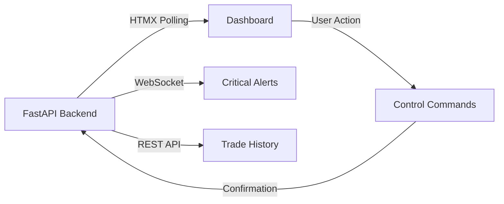

# Front-End Specification Document
## SPX 0DTE Iron Condor Trading Bot

---

## 1. Project Overview

### 1.1 Executive Summary
This document specifies the complete front-end implementation for an automated SPX 0DTE Iron Condor trading bot. The interface provides real-time monitoring, control capabilities, and performance analytics through a web dashboard with mobile responsiveness.

### 1.2 Design Philosophy
- **Status-First Architecture**: Immediate system health visibility
- **Progressive Disclosure**: Summary views with drill-down capabilities
- **Safety Through Design**: Multi-step confirmations for critical actions
- **Real-Time Without Complexity**: Server-side rendering with HTMX
- **Professional Aesthetics**: Apple Aqua-inspired design language

### 1.3 Target Users
- **Primary**: Professional options trader (single user)
- **Experience Level**: Advanced trading knowledge, expects financial-grade interface
- **Access Patterns**: Desktop monitoring during market hours, mobile for alerts and emergency controls

---

## 2. Technical Architecture

### 2.1 Technology Stack
```yaml
Frontend:
  - HTML5 with semantic markup
  - CSS3 with modern features (Grid, Flexbox, Custom Properties)
  - HTMX for real-time updates (no build pipeline)
  - Chart.js for data visualization
  - Vanilla JavaScript for minimal interactivity

Backend Integration:
  - FastAPI REST endpoints
  - Server-sent events for live updates
  - WebSocket fallback for critical alerts

Styling Framework:
  - Custom CSS with Aqua design system
  - CSS Variables for theming
  - Mobile-first responsive design
```

### 2.2 Browser Requirements
- **Desktop**: Chrome 90+, Safari 14+, Firefox 88+, Edge 90+
- **Mobile**: iOS Safari 14+, Chrome Mobile 90+
- **Required Features**: CSS Grid, Flexbox, Custom Properties, HTMX support

### 2.3 Performance Targets
- **Initial Load**: < 2 seconds
- **Update Latency**: < 500ms for status updates
- **Mobile Performance**: 90+ Lighthouse score
- **Offline Capability**: Last known status cached for 15 minutes

---

## 3. Information Architecture

### 3.1 Navigation Structure
```
Root (/)
├── Dashboard (Main View)
│   ├── Header with Kill Switch
│   ├── System Status Panel
│   ├── Active Position Card
│   ├── Performance Metrics
│   ├── Position Monitoring Bar
│   └── Footer Controls (conditional)
├── Trade History (/trades)
│   ├── Trade Log Table
│   ├── Filters & Search
│   └── Export Controls
├── Analytics (/analytics)
│   ├── Equity Curve
│   ├── Performance Metrics
│   └── Risk Analysis
└── Settings (/settings)
    ├── Trading Parameters
    ├── Notification Preferences
    └── Account Configuration
```

### 3.2 Data Flow


---

## 4. Page Specifications

### 4.1 Dashboard (Main View)

#### 4.1.1 Layout Grid
```css
.dashboard-grid {
  display: grid;
  grid-template-areas:
    "header header header"
    "status status status"
    "metrics position next"
    "progress progress progress"
    "monitoring monitoring monitoring"
    "history history history"
    "footer footer footer";
  gap: var(--spacing-md);
}

@media (max-width: 768px) {
  .dashboard-grid {
    grid-template-areas:
      "header"
      "status"
      "metrics"
      "position"
      "next"
      "progress"
      "monitoring"
      "history"
      "footer";
  }
}
```

#### 4.1.2 Component Specifications

**A. System Status Bar**
```html
<div class="status-bar" hx-get="/api/status" hx-trigger="every 2s">
  <div class="status-indicator status--connected">
    <span class="status-dot"></span>
    <span class="status-text">Connected</span>
  </div>
  <div class="status-phase">Phase: Monitoring</div>
  <div class="status-mode">Mode: Live</div>
</div>
```

**Visual States:**
- Connected: Green pulsing dot (#00C851)
- Warning: Yellow pulsing dot (#FFD600)
- Error: Red pulsing dot (#FF1744)

**B. Metrics Cards**
```html
<div class="metrics-grid">
  <div class="metric-card metric--pnl">
    <h3 class="metric-label">Today's P/L</h3>
    <div class="metric-value positive">+$127.50</div>
    <div class="metric-change">▲ 2.55%</div>
  </div>
  
  <div class="metric-card metric--position">
    <h3 class="metric-label">Active Position</h3>
    <div class="metric-value">IC 5500/5520-5680/5700</div>
    <div class="metric-status">Monitoring...</div>
  </div>
  
  <div class="metric-card metric--next">
    <h3 class="metric-label">Next Trade</h3>
    <div class="metric-value">Tomorrow</div>
    <div class="metric-countdown">15:32 CET (09:32 ET)</div>
  </div>
</div>
```

**C. Progress Tracker**
```html
<div class="progress-tracker">
  <div class="progress-step completed">
    <span class="step-icon">✅</span>
    <span class="step-label">TWS Connected</span>
  </div>
  <div class="progress-step completed">
    <span class="step-icon">✅</span>
    <span class="step-label">Market Open</span>
  </div>
  <div class="progress-step active">
    <span class="step-icon">⏳</span>
    <span class="step-label">Monitoring</span>
  </div>
  <div class="progress-step pending">
    <span class="step-icon">○</span>
    <span class="step-label">Exit</span>
  </div>
</div>
```

**D. Position Monitoring Bar**
```html
<div class="position-monitoring" hx-get="/api/position" hx-trigger="every 10s" 
     style="display: none;" data-has-position="false">
  <div class="position-entry">
    <span class="label">Entry Credit:</span>
    <span class="value">$500</span>
    <span class="separator">|</span>
    <span class="label">Target:</span>
    <span class="value">$375</span>
    <span class="detail">(25% PT)</span>
  </div>
  <div class="position-current">
    <span class="label">Current P/L:</span>
    <span class="value negative">-$32.50</span>
    <span class="percentage">(-0.65%)</span>
  </div>
  <div class="position-progress">
    <div class="progress-bar">
      <div class="progress-fill" style="width: 74%"></div>
    </div>
    <span class="progress-text">74% to target</span>
  </div>
  <div class="position-time">
    <span class="label">Time to Exit:</span>
    <span class="value">5h 23m</span>
  </div>
</div>
```

### 4.2 Trade History View

#### 4.2.1 Table Structure
```html
<table class="trade-table">
  <thead>
    <tr>
      <th>Date</th>
      <th>Entry Time</th>
      <th>Strikes</th>
      <th>Entry Credit</th>
      <th>Exit Price</th>
      <th>P/L</th>
      <th>Exit Reason</th>
      <th>Actions</th>
    </tr>
  </thead>
  <tbody hx-get="/api/trades" hx-trigger="load">
    <!-- Rows populated by HTMX -->
  </tbody>
</table>
```

#### 4.2.2 Filter Controls
```html
<div class="filter-bar">
  <input type="date" name="start_date" />
  <input type="date" name="end_date" />
  <select name="exit_reason">
    <option value="">All</option>
    <option value="profit_target">Profit Target</option>
    <option value="time_exit">Time Exit</option>
    <option value="stop_loss">Stop Loss</option>
  </select>
  <button class="btn-filter">Apply Filters</button>
  <button class="btn-export">Export CSV</button>
</div>
```

### 4.3 Settings Page

#### 4.3.1 Settings Layout
```html
<div class="settings-container">
  <h2 class="settings-title">Bot Configuration</h2>
  
  <!-- Connection Settings -->
  <section class="settings-section">
    <h3 class="section-title">TWS Connection</h3>
    <div class="setting-group">
      <label for="tws-host">Host</label>
      <input type="text" id="tws-host" value="127.0.0.1" />
      <small>Usually 127.0.0.1 for local TWS</small>
    </div>
    <div class="setting-group">
      <label for="tws-port">Port</label>
      <select id="tws-port">
        <option value="7496">7496 - Live Trading</option>
        <option value="7497">7497 - Paper Trading</option>
      </select>
      <small>Live: 7496, Paper: 7497</small>
    </div>
    <div class="setting-group">
      <label for="client-id">Client ID</label>
      <input type="number" id="client-id" value="1" min="0" max="999" />
      <small>Unique ID for this connection (0-999)</small>
    </div>
  </section>

  <!-- Trading Parameters -->
  <section class="settings-section">
    <h3 class="section-title">Trading Parameters</h3>
    <div class="setting-group">
      <label for="position-size">Position Size</label>
      <input type="number" id="position-size" value="1" min="1" max="10" />
      <small>Number of contracts per trade</small>
    </div>
    <div class="setting-group">
      <label for="target-delta">Target Delta</label>
      <input type="number" id="target-delta" value="15" min="10" max="20" step="0.5" />
      <small>Target delta for short strikes (default: 15)</small>
    </div>
    <div class="setting-group">
      <label for="wing-offset">Wing Offset</label>
      <input type="number" id="wing-offset" value="20" min="10" max="50" />
      <small>Points between short and long strikes</small>
    </div>
    <div class="setting-group">
      <label for="profit-target">Profit Target %</label>
      <input type="number" id="profit-target" value="25" min="10" max="50" />
      <small>Percentage of credit to keep as profit</small>
    </div>
  </section>

  <!-- Discord Integration -->
  <section class="settings-section">
    <h3 class="section-title">Discord Notifications</h3>
    <div class="setting-group">
      <label for="discord-enabled">Enable Discord</label>
      <input type="checkbox" id="discord-enabled" checked />
    </div>
    <div class="setting-group">
      <label for="discord-token">Bot Token</label>
      <input type="password" id="discord-token" placeholder="Enter Discord bot token" />
      <small>Keep this secret! Never share your bot token</small>
    </div>
    <div class="setting-group">
      <label for="discord-channel">Channel ID</label>
      <input type="text" id="discord-channel" placeholder="Channel ID for notifications" />
      <small>Right-click channel → Copy ID</small>
    </div>
  </section>

  <!-- System Settings -->
  <section class="settings-section">
    <h3 class="section-title">System Configuration</h3>
    <div class="setting-group">
      <label for="web-port">Web Dashboard Port</label>
      <input type="number" id="web-port" value="8000" min="1024" max="65535" />
      <small>Port for accessing this dashboard</small>
    </div>
    <div class="setting-group">
      <label for="display-timezone">Display Timezone</label>
      <select id="display-timezone">
        <option value="Europe/Berlin" selected>CET - Central European Time</option>
        <option value="Europe/London">GMT - Greenwich Mean Time</option>
        <option value="America/New_York">ET - Eastern Time</option>
        <option value="America/Chicago">CT - Central Time</option>
        <option value="America/Los_Angeles">PT - Pacific Time</option>
      </select>
      <small>Times will show as: 15:32 CET (09:32 ET)</small>
    </div>
    <div class="setting-group">
      <label for="log-level">Log Level</label>
      <select id="log-level">
        <option value="ERROR">Error Only</option>
        <option value="WARNING">Warning</option>
        <option value="INFO" selected>Info</option>
        <option value="DEBUG">Debug</option>
      </select>
    </div>
  </section>

  <!-- Save Actions -->
  <div class="settings-actions">
    <button class="btn btn-primary" onclick="saveSettings()">
      Save Settings
    </button>
    <button class="btn btn-secondary" onclick="testConnection()">
      Test TWS Connection
    </button>
    <button class="btn btn-secondary" onclick="testDiscord()">
      Test Discord
    </button>
  </div>
</div>
```

#### 4.3.2 Settings Validation
```javascript
function saveSettings() {
  // Validate required fields
  const requiredFields = ['tws-host', 'tws-port', 'position-size'];
  for (const field of requiredFields) {
    if (!document.getElementById(field).value) {
      alert(`${field} is required`);
      return;
    }
  }
  
  // Confirm dangerous changes
  const port = document.getElementById('tws-port').value;
  if (port === '7496') {
    if (!confirm('You selected LIVE trading port. Are you sure?')) {
      return;
    }
  }
  
  // Save via API
  const settings = collectSettings();
  htmx.ajax('POST', '/api/settings', {
    values: settings,
    target: '#status-message'
  });
}

function testConnection() {
  const btn = event.target;
  btn.disabled = true;
  btn.textContent = 'Testing...';
  
  htmx.ajax('POST', '/api/test-tws', {
    target: '#connection-status',
    swap: 'innerHTML'
  }).then(() => {
    btn.disabled = false;
    btn.textContent = 'Test TWS Connection';
  });
}
```

### 4.4 Footer Controls

#### 4.3.1 Conditional Controls
```html
<!-- Footer with conditional controls based on mode -->
<footer class="footer-controls">
  <!-- Manual Test Button - Only visible in Experiment Mode -->
  <button 
    id="manual-test-btn"
    class="btn btn-primary"
    style="display: none;"
    hx-post="/api/test-trade"
    hx-confirm="Execute test trade now?">
    Manual Test
  </button>
  
  <!-- View Logs - Always visible -->
  <button class="btn btn-secondary" onclick="openLogsModal()">
    View Logs
  </button>
</footer>

<script>
// Show/hide Manual Test based on mode
function updateControlsVisibility(mode) {
  const testBtn = document.getElementById('manual-test-btn');
  if (mode === 'experiment') {
    testBtn.style.display = 'inline-block';
  } else {
    testBtn.style.display = 'none';
  }
}
</script>
```

#### 4.3.2 Kill Switch in Header
```html
<!-- Kill Switch is part of the main header for prominence -->
<header class="dashboard-header">
  <h1 class="dashboard-title">SPX Iron Condor Bot</h1>
  <div class="header-controls">
    <button 
      class="kill-switch-btn"
      onclick="confirmKillSwitch()"
      aria-label="Activate emergency stop">
      <span class="kill-icon">🛑</span>
      <span class="kill-text">KILL SWITCH</span>
    </button>
  </div>
</header>

<!-- Kill Switch Confirmation Modal -->
<div id="kill-switch-modal" class="modal hidden">
  <div class="modal-content">
    <h3>⚠️ Emergency Stop</h3>
    <p>This will immediately:</p>
    <ul>
      <li>Cancel all pending orders</li>
      <li>Close all open positions at market</li>
      <li>Disable trading for today</li>
    </ul>
    <p class="confirm-text">Are you sure you want to stop all trading?</p>
    <div class="modal-actions">
      <button class="btn-danger" onclick="executeKillSwitch()">
        Yes, Stop Trading
      </button>
      <button class="btn-cancel" onclick="closeModal()">
        Cancel
      </button>
    </div>
  </div>
</div>

<script>
function executeKillSwitch() {
  htmx.ajax('POST', '/api/kill-switch', {target: '#status-panel'});
  closeModal();
}
</script>
```

---

## 5. Visual Design System

### 5.1 Apple Aqua Design Language

#### 5.1.1 Color Palette
```css
:root {
  /* Primary Colors */
  --aqua-primary: #007AFF;
  --aqua-secondary: #5AC8FA;
  --aqua-tertiary: #34C759;
  
  /* Status Colors */
  --status-success: #00C851;
  --status-warning: #FFD600;
  --status-danger: #FF1744;
  
  /* Profit/Loss Colors */
  --profit-green: #4CAF50;
  --loss-red: #F44336;
  
  /* Neutral Colors */
  --gray-100: #F7F7F7;
  --gray-200: #E5E5E7;
  --gray-300: #D1D1D6;
  --gray-400: #C7C7CC;
  --gray-500: #8E8E93;
  --gray-600: #636366;
  --gray-700: #48484A;
  --gray-800: #3A3A3C;
  --gray-900: #1C1C1E;
  
  /* Glass Effects */
  --glass-bg: rgba(255, 255, 255, 0.72);
  --glass-border: rgba(255, 255, 255, 0.18);
  --backdrop-blur: blur(20px);
}
```

#### 5.1.2 Typography
```css
:root {
  --font-system: -apple-system, BlinkMacSystemFont, "SF Pro Display", 
                 "Segoe UI", Roboto, "Helvetica Neue", Arial, sans-serif;
  --font-mono: "SF Mono", Monaco, "Cascadia Code", "Roboto Mono", monospace;
  
  /* Font Sizes */
  --text-xs: 0.75rem;    /* 12px */
  --text-sm: 0.875rem;   /* 14px */
  --text-base: 1rem;     /* 16px */
  --text-lg: 1.125rem;   /* 18px */
  --text-xl: 1.25rem;    /* 20px */
  --text-2xl: 1.5rem;    /* 24px */
  --text-3xl: 1.875rem;  /* 30px */
  --text-4xl: 2.25rem;   /* 36px */
  
  /* Font Weights */
  --font-light: 300;
  --font-regular: 400;
  --font-medium: 500;
  --font-semibold: 600;
  --font-bold: 700;
}
```

#### 5.1.3 Component Styles

**Glass Card Effect**
```css
.glass-card {
  background: var(--glass-bg);
  backdrop-filter: var(--backdrop-blur);
  -webkit-backdrop-filter: var(--backdrop-blur);
  border: 1px solid var(--glass-border);
  border-radius: 16px;
  box-shadow: 
    0 4px 6px rgba(0, 0, 0, 0.07),
    0 0 0 1px rgba(255, 255, 255, 0.1) inset;
}
```

**Aqua Button**
```css
.btn-aqua {
  background: linear-gradient(180deg, #5AC8FA 0%, #007AFF 100%);
  border: 1px solid rgba(0, 122, 255, 0.3);
  border-radius: 8px;
  color: white;
  font-weight: var(--font-medium);
  padding: 10px 20px;
  transition: all 0.2s ease;
  box-shadow: 
    0 2px 4px rgba(0, 122, 255, 0.2),
    0 0 0 1px rgba(255, 255, 255, 0.2) inset;
}

.btn-aqua:hover {
  transform: translateY(-1px);
  box-shadow: 
    0 4px 8px rgba(0, 122, 255, 0.3),
    0 0 0 1px rgba(255, 255, 255, 0.3) inset;
}

.btn-aqua:active {
  transform: translateY(0);
  background: linear-gradient(180deg, #4BB8E8 0%, #0066DD 100%);
}
```

### 5.2 Dark Mode Support
```css
@media (prefers-color-scheme: dark) {
  :root {
    --glass-bg: rgba(30, 30, 30, 0.72);
    --glass-border: rgba(255, 255, 255, 0.08);
    --text-primary: #FFFFFF;
    --text-secondary: #A1A1A6;
    --bg-primary: #000000;
    --bg-secondary: #1C1C1E;
  }
  
  .glass-card {
    background: var(--glass-bg);
    box-shadow: 
      0 4px 6px rgba(0, 0, 0, 0.3),
      0 0 0 1px rgba(255, 255, 255, 0.05) inset;
  }
}
```

---

## 6. Interaction Design

### 6.1 Micro-Interactions

#### 6.1.1 Status Indicator Animation
```css
@keyframes pulse {
  0% {
    box-shadow: 0 0 0 0 currentColor;
    opacity: 1;
  }
  70% {
    box-shadow: 0 0 0 10px currentColor;
    opacity: 0;
  }
  100% {
    box-shadow: 0 0 0 0 currentColor;
    opacity: 0;
  }
}

.status-dot {
  animation: pulse 2s infinite;
}
```

#### 6.1.2 Progress to Profit Target
```css
.progress-bar {
  background: linear-gradient(90deg, 
    #F44336 0%,     /* Red at 0% */
    #FFD600 50%,    /* Yellow at 50% */
    #4CAF50 100%    /* Green at 100% (profit target) */
  );
  height: 8px;
  border-radius: 4px;
  position: relative;
  overflow: hidden;
}

.progress-fill {
  height: 100%;
  background: rgba(255, 255, 255, 0.3);
  transition: width 0.5s ease;
}
```

#### 6.1.3 Card Hover Effects
```css
.metric-card {
  transition: all 0.3s cubic-bezier(0.4, 0, 0.2, 1);
}

.metric-card:hover {
  transform: translateY(-4px);
  box-shadow: 
    0 10px 20px rgba(0, 0, 0, 0.1),
    0 0 0 1px rgba(255, 255, 255, 0.2) inset;
}
```

### 6.2 Loading States
```html
<!-- Skeleton Loading -->
<div class="skeleton-card">
  <div class="skeleton-line skeleton-title"></div>
  <div class="skeleton-line skeleton-value"></div>
  <div class="skeleton-line skeleton-subtitle"></div>
</div>
```

```css
.skeleton-line {
  background: linear-gradient(
    90deg,
    var(--gray-200) 25%,
    var(--gray-300) 50%,
    var(--gray-200) 75%
  );
  background-size: 200% 100%;
  animation: shimmer 1.5s infinite;
}

@keyframes shimmer {
  0% { background-position: -200% 0; }
  100% { background-position: 200% 0; }
}
```

### 6.3 Error States
```html
<div class="error-state">
  <div class="error-icon">⚠️</div>
  <h3 class="error-title">Connection Lost</h3>
  <p class="error-message">Unable to connect to TWS. Retrying...</p>
  <div class="error-actions">
    <button class="btn-retry" hx-get="/api/reconnect">
      Retry Now
    </button>
    <button class="btn-secondary">View Logs</button>
  </div>
</div>
```

---

## 7. Mobile Experience

### 7.1 Responsive Breakpoints
```css
/* Mobile First Approach */
/* Base: 0-640px (Mobile) */
/* Small: 640px+ (Large Mobile) */
/* Medium: 768px+ (Tablet) */
/* Large: 1024px+ (Desktop) */
/* XL: 1280px+ (Large Desktop) */

@media (min-width: 640px) { /* sm */ }
@media (min-width: 768px) { /* md */ }
@media (min-width: 1024px) { /* lg */ }
@media (min-width: 1280px) { /* xl */ }
```

### 7.2 Mobile-Specific Interface
```html
<!-- Mobile Navigation -->
<nav class="mobile-nav">
  <a href="/" class="nav-item active">
    <span class="nav-icon">📊</span>
    <span class="nav-label">Dashboard</span>
  </a>
  <a href="/trades" class="nav-item">
    <span class="nav-icon">📈</span>
    <span class="nav-label">Trades</span>
  </a>
  <a href="/emergency" class="nav-item nav-emergency">
    <span class="nav-icon">🛑</span>
    <span class="nav-label">Emergency</span>
  </a>
</nav>
```

### 7.3 Touch Targets
```css
/* Minimum 44x44px touch targets */
.btn, .nav-item, .clickable {
  min-height: 44px;
  min-width: 44px;
  display: flex;
  align-items: center;
  justify-content: center;
}

/* Increased spacing on mobile */
@media (max-width: 768px) {
  .btn + .btn {
    margin-top: 12px;
  }
}
```

### 7.4 Gesture Support
```javascript
// Swipe navigation
let touchStartX = 0;
let touchEndX = 0;

function handleSwipe() {
  if (touchEndX < touchStartX - 50) {
    // Swipe left - next page
    navigateNext();
  }
  if (touchEndX > touchStartX + 50) {
    // Swipe right - previous page
    navigatePrev();
  }
}

document.addEventListener('touchstart', e => {
  touchStartX = e.changedTouches[0].screenX;
});

document.addEventListener('touchend', e => {
  touchEndX = e.changedTouches[0].screenX;
  handleSwipe();
});
```

---

## 8. Real-Time Updates with HTMX

### 8.1 Status Polling
```html
<!-- Auto-refresh every 2 seconds -->
<div id="status-panel" 
     hx-get="/api/status" 
     hx-trigger="every 2s"
     hx-swap="innerHTML">
  <!-- Content replaced by server -->
</div>
```

### 8.2 Progressive Updates
```html
<!-- Load more trades on scroll -->
<tbody id="trade-rows"
       hx-get="/api/trades?page=2"
       hx-trigger="revealed"
       hx-swap="afterend">
  <!-- Infinite scroll -->
</tbody>
```

### 8.3 Optimistic UI Updates
```html
<!-- Immediate feedback -->
<button hx-post="/api/actions/close-position"
        hx-indicator="#loading"
        hx-confirm="Close position immediately?">
  Close Position
</button>

<div id="loading" class="htmx-indicator">
  <div class="spinner"></div>
</div>
```

---

## 9. Accessibility Implementation

### 9.1 ARIA Labels and Roles
```html
<div role="main" aria-label="Trading Dashboard">
  <section aria-labelledby="metrics-heading">
    <h2 id="metrics-heading" class="sr-only">Performance Metrics</h2>
    
    <div role="status" aria-live="polite" aria-atomic="true">
      <span class="metric-value">+$127.50</span>
    </div>
  </section>
</div>
```

### 9.2 Keyboard Navigation
```css
/* Focus styles */
:focus-visible {
  outline: 2px solid var(--aqua-primary);
  outline-offset: 2px;
}

/* Skip to main content */
.skip-link {
  position: absolute;
  top: -40px;
  left: 0;
  background: var(--aqua-primary);
  color: white;
  padding: 8px;
  text-decoration: none;
  z-index: 100;
}

.skip-link:focus {
  top: 0;
}
```

### 9.3 Screen Reader Support
```html
<!-- Accessible data table -->
<table role="table" aria-label="Trade History">
  <caption class="sr-only">
    Historical trades with entry, exit, and profit/loss information
  </caption>
  <thead>
    <tr role="row">
      <th role="columnheader" scope="col">Date</th>
      <th role="columnheader" scope="col">P/L</th>
    </tr>
  </thead>
</table>
```

### 9.4 Color Contrast
```css
/* WCAG AA Compliant Colors */
.text-primary {
  color: #1C1C1E; /* 12.63:1 on white */
}

.text-secondary {
  color: #636366; /* 4.96:1 on white */
}

/* High contrast mode support */
@media (prefers-contrast: high) {
  :root {
    --text-primary: #000000;
    --text-secondary: #000000;
    --bg-primary: #FFFFFF;
  }
}
```

---

## 10. Performance Optimization

### 10.1 Critical CSS
```html
<style>
  /* Inline critical CSS for above-the-fold content */
  .dashboard-grid { /* ... */ }
  .status-bar { /* ... */ }
  .metric-card { /* ... */ }
</style>

<!-- Load non-critical CSS asynchronously -->
<link rel="preload" href="/css/main.css" as="style" onload="this.onload=null;this.rel='stylesheet'">
```

### 10.2 Resource Hints
```html
<!-- DNS Prefetch for API -->
<link rel="dns-prefetch" href="//api.tradingbot.local">

<!-- Preconnect for WebSocket -->
<link rel="preconnect" href="wss://api.tradingbot.local">

<!-- Prefetch next likely navigation -->
<link rel="prefetch" href="/trades">
```

### 10.3 Progressive Enhancement
```javascript
// Check for HTMX support
if (typeof htmx !== 'undefined') {
  // Enhanced experience
  document.body.classList.add('htmx-enabled');
} else {
  // Fallback to standard forms
  initFallbackHandlers();
}
```

---

## 11. Testing Requirements

### 11.1 Browser Testing Matrix
| Browser | Version | Desktop | Mobile |
|---------|---------|---------|--------|
| Chrome | 90+ | ✓ | ✓ |
| Safari | 14+ | ✓ | ✓ |
| Firefox | 88+ | ✓ | ✓ |
| Edge | 90+ | ✓ | - |

### 11.2 Device Testing
- **Desktop**: 1920x1080, 1440x900, 1366x768
- **Tablet**: iPad Pro, iPad Air, Surface
- **Mobile**: iPhone 14 Pro, iPhone SE, Samsung Galaxy S23

### 11.3 Performance Benchmarks
- **First Contentful Paint**: < 1.5s
- **Time to Interactive**: < 3.5s
- **Cumulative Layout Shift**: < 0.1
- **First Input Delay**: < 100ms

### 11.4 Accessibility Testing
- **Screen Readers**: NVDA, JAWS, VoiceOver
- **Keyboard Navigation**: Full functionality without mouse
- **Color Contrast**: WCAG AA compliance
- **Motion Sensitivity**: Respects prefers-reduced-motion

---

## 12. Security Considerations

### 12.1 Authentication
```javascript
// Session-based auth with CSRF protection
const csrfToken = document.querySelector('meta[name="csrf-token"]').content;

htmx.config.httpHeaders = {
  'X-CSRF-Token': csrfToken
};
```

### 12.2 Content Security Policy
```html
<meta http-equiv="Content-Security-Policy" 
      content="default-src 'self'; 
               script-src 'self' 'unsafe-inline' htmx.org; 
               style-src 'self' 'unsafe-inline'; 
               connect-src 'self' wss://api.tradingbot.local;">
```

### 12.3 Input Validation
```javascript
// Client-side validation (supplement server-side)
function validateTradeParams(params) {
  const delta = parseFloat(params.delta);
  if (delta < 13 || delta > 17) {
    throw new Error('Delta must be between 13 and 17');
  }
  // Additional validations...
}
```

---

## 13. Deployment Checklist

### 13.1 Pre-Deployment
- [ ] Minify CSS and JavaScript
- [ ] Optimize images (WebP with fallbacks)
- [ ] Enable compression (gzip/brotli)
- [ ] Configure caching headers
- [ ] Test error pages (404, 500)
- [ ] Verify SSL certificate
- [ ] Check meta tags and SEO basics
- [ ] Validate HTML/CSS
- [ ] Run accessibility audit
- [ ] Performance testing complete

### 13.2 Post-Deployment
- [ ] Monitor real user metrics
- [ ] Check error tracking
- [ ] Verify all HTMX endpoints
- [ ] Test emergency controls
- [ ] Confirm notification system
- [ ] Review server logs
- [ ] Load test critical paths
- [ ] Document known issues

---

## 14. Future Enhancements

### 14.1 Phase 2 Features
- Advanced charting with TradingView integration
- Multi-strategy dashboard views
- Historical backtest visualization
- Risk metrics heatmaps
- Custom alert configuration UI

### 14.2 Phase 3 Features
- Native mobile app (React Native)
- Desktop app (Electron)
- Multi-user support with roles
- Advanced analytics dashboard
- ML-powered insights visualization

---

## Appendix A: Component Library

### Standard Components
```html
<!-- Primary Button -->
<button class="btn btn-primary">Execute Trade</button>

<!-- Secondary Button -->
<button class="btn btn-secondary">View Details</button>

<!-- Danger Button -->
<button class="btn btn-danger">Emergency Stop</button>

<!-- Info Alert -->
<div class="alert alert-info">
  <span class="alert-icon">ℹ️</span>
  <span class="alert-text">Market opens in 15 minutes</span>
</div>

<!-- Success Alert -->
<div class="alert alert-success">
  <span class="alert-icon">✅</span>
  <span class="alert-text">Trade executed successfully</span>
</div>

<!-- Loading Spinner -->
<div class="spinner-container">
  <div class="spinner"></div>
  <span class="spinner-text">Loading...</span>
</div>
```

---

## Appendix B: API Endpoints

### Required Endpoints for Frontend
```yaml
Dashboard:
  GET /api/status: Current system status
  GET /api/metrics: Performance metrics
  GET /api/position: Active position details
  GET /api/market: Market data

Trades:
  GET /api/trades: Trade history (paginated)
  GET /api/trades/{id}: Single trade details
  POST /api/trades/export: Export CSV

Controls:
  POST /api/kill-switch: Emergency stop
  POST /api/actions/close: Close position
  POST /api/settings: Update settings

Real-time:
  WS /ws: WebSocket for live updates
  SSE /events: Server-sent events fallback
```

---

*Document Version: 1.0*
*Created: 2025-08-14*
*Author: Sally - UX Expert*