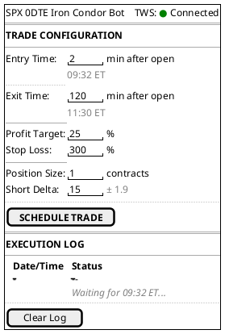
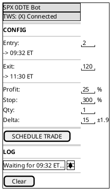
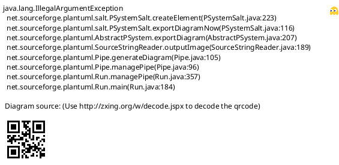
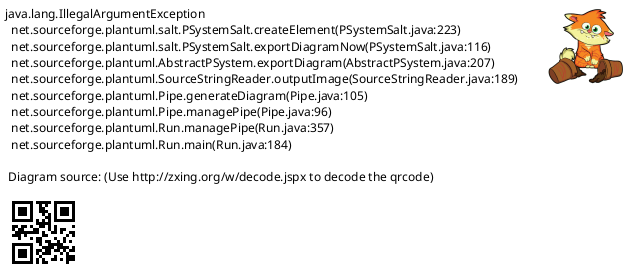
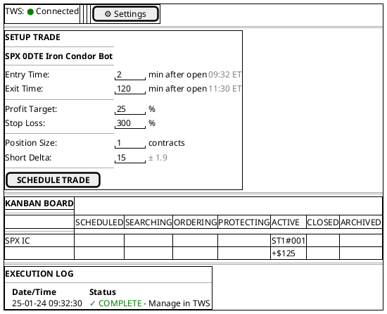
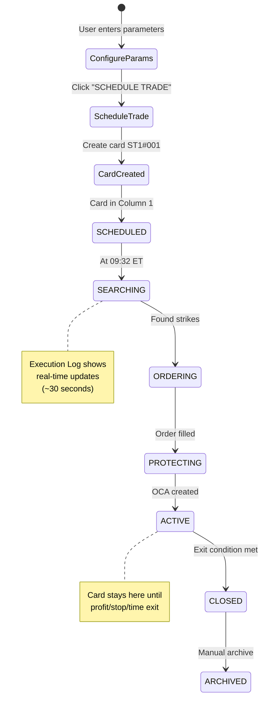

# UI/UX Specification for Options Strategy Bot Trader

## Executive Summary

This document defines the user interface and user experience design for the Options Strategy Bot Trader, addressing the critical issues identified in initial designs and establishing clear, intuitive interaction patterns.

## Design Philosophy

### Core Principles
1. **Clarity Over Features** - In critical moments, users need instant understanding
2. **Consistent Hierarchy** - Strict separation between system, strategy, and trade levels
3. **Safety First** - Dangerous actions are visually distinct and require confirmation
4. **Mobile Ready** - All critical functions accessible on mobile devices

### CRITICAL DESIGN PRINCIPLE: Generic Abstraction Over Strategy-Specific Design
**Core Rule**: Strategy implementations are EXAMPLES for design abstraction, NOT targets for custom layouts.

**Key Requirements**:
- Every UI element must work for ANY future strategy without modification
- Card layout is FROZEN: 7 lines total, fixed positions, generic labels
- No strategy-specific special cases or custom fields
- Always ask: "What do I REALLY need to see?" - Remember TWS is always available for details
- When in doubt: Simpler is better. Show less, not more.

### Key Problems Solved
- ✅ Clear visual hierarchy (no mixing of global/local controls)
- ✅ Understandable labels (no cryptic abbreviations)
- ✅ Obvious emergency controls (always same position)
- ✅ Simple mode switching per strategy (no complex global state)

## Information Architecture

```
LEVEL 1: SYSTEM HEADER
├── Application Title
├── TWS Connection Status
├── Settings Access [⚙️]
└── Emergency Stop [🔴]

LEVEL 2: STRATEGY CARDS
├── Strategy Name & Status
├── Mode Control (Live/Experiment)
├── Current P/L
├── Quick Actions
└── Active Trade Summary

LEVEL 3: TRADE DETAILS (On-Demand)
├── Entry/Exit Information
├── Progress Tracking
└── Technical Details
```

## Component Library

### Status Indicators
- `● ACTIVE` - Green dot + text (strategy running)
- `○ WAITING` - Gray dot + text (strategy idle)
- `⚠ WARNING` - Yellow dot + text (attention needed)
- `✕ ERROR` - Red dot + text (critical issue)

### Mode Indicators
- `💰` - LIVE mode (real money trading)
- `🧪` - EXPERIMENT mode (simulated trading)

### Action Buttons
- **Primary**: `[▶ Start]` `[⏸ Pause]` - Large, clear icons
- **Secondary**: `[👁 View]` `[📊 History]` - Smaller, subtle
- **Danger**: `[🔴 EMERGENCY STOP]` - Always red, isolated, top-right

### Information Display
```
Label: Value          ← Static information
P/L: +$125.50

Progress: X → Y       ← Goal tracking
$125 → $200 target
```

## Epic 1: Minimal Trading Interface (Pre-Kanban)

### Overview
Epic 1 introduces a minimal "fire & forget" interface for single daily trade execution. No Kanban board, no persistent state management - just schedule a trade and let TWS manage it after execution.

### Fire & Forget Principle
- **No State Persistence**: After OCA order creation, the system "forgets" the position
- **No P/L Tracking**: No ongoing monitoring of profit/loss after execution
- **TWS Handoff**: After successful execution, trader manages position in TWS
- **Daily Scope**: Execution log cleared daily, no history retention

### UI Layout

#### Desktop View (600px centered)


#### Mobile View (full-width responsive)


### Execution States

#### 1. During Execution (09:32 ET)
The system executes the trade and provides real-time updates for approximately 30-60 seconds:



#### 2. After Execution
Button disabled until configuration changes or new day begins. Log shows completion status.

### Button Enable/Disable Logic

**Button DISABLED when:**
- Trade already executed AND configuration unchanged
- Current time > configured entry time
- TWS not connected

**Button ENABLED when:**
- No trade executed today yet
- Trade executed BUT configuration changed AND new time is in future
- After midnight (new trading day)

### Real-time Features

#### Time Conversion
- User inputs offset in minutes (e.g., "2 min after open")
- System displays calculated ET time (e.g., "09:32 ET")
- Optional: User's local timezone if configured

#### Server-Sent Events (SSE)
- Active ONLY during execution (09:32:00 - 09:32:30)
- Updates execution log in real-time
- Connection closes after completion
- No polling or persistent connections

### Error Handling

Execution errors are shown in the log with clear descriptions:



### Form Validation

- **Entry Time**: Must be future time, >= 0 min after open
- **Exit Time**: Must be > Entry Time
- **Profit Target**: 1-100%
- **Stop Loss**: 100-500%
- **Position Size**: >= 1
- **Short Delta**: 5-25 (± tolerance shown)

---

## Epic 2: Integrated Dashboard (Epic 1 + Kanban)

### Overview
Epic 2 combines the Epic 1 Setup Trade interface with the new Kanban Board on a single page. Both components share state, allowing seamless transition from scheduling to tracking.

### Desktop Layout

The Epic 1 UI (600px centered) sits above the full-width Kanban Board:



### State Synchronization



**Key Points:**
- Single click creates card with unique ID (e.g., ST1#001)
- Card automatically progresses through states during execution
- Execution Log mirrors state changes in real-time
- Both UI components share the same state manager

### Mobile Layout

**Vertical Scroll Approach:**
- Setup Trade section at top (always accessible)
- Scroll down to see Kanban Board
- Execution Log at bottom
- Sticky header with TWS connection status

---

## Main Dashboard Layout - Kanban Board Architecture (Epic 2+)

### Core Concept: Strategy Instance Management
The dashboard uses a revolutionary Kanban-based approach that distinguishes between:
- **STRATEGY** - The trading rule set (configured via Meta-Strategy Model)
- **STRATEGY INSTANCE** - Individual executions of that strategy

This enables tracking multiple parallel instances per strategy (e.g., multi-week strategies can have 3+ concurrent positions).

### Desktop Kanban View
```
┌─────────────────────────────────────────────────────────────────────────────────────────────────────────────────────────┐
│ Options Trading Bot Dashboard                              [⚙️ Settings] [🔴 STOP ALL]                  │
│ TWS: ● Connected                                                                                                        │
├─────────────────────────────────────────────────────────────────────────────────────────────────────────────────────────┤
│                                                                                                                         │
│ KANBAN BOARD                                     Portfolio P/L: +$1,450 💰 | +$780 🧪 | +$2,230 Total │
│ ━━━━━━━━━━━━━━━━━━━━━━━━━━━━━━━━━━━━━━━━━━━━━━━━━━━━━━━━━━━━━━━━━━━━━━━━━━━━━━━━━━━━━━━━━━━━━━━━━━━━━━━━━━━━━━━━━━━━━━━ │
│                                                                                                                         │
├─────────┬─────────┬─────────┬─────────┬─────────┬─────────┬─────────┐                                                   │
│  NEXT   │ SEARCH  │ PLACE   │ SETUP   │ ACTIVE  │ CLOSED  │ ARCHIVE │                                                   │
│         │ OPTIONS │ ORDER   │ ORDER   │         │         │         │                                                   │
│         │         │         │  EXIT   │         │         │         │                                                   │
├─────────┼─────────┼─────────┼─────────┼─────────┼─────────┼─────────┤                                                   │
│         │         │         │         │         │         │         │ STRATEGY TYPE A                                   │
│ST1#003  │         │ST1#002  │         │ST1#001  │ST1#999  │ST1#990  │ P/L: +$680 💰 | +$340 🧪                         │
│✅ Ready │         │🔄 Doing │         │✅ Good  │✅ Done  │✅ Done  │ Mode: [LIVE] [EXPERIMENT]                         │
│Tom 9:32 │         │Placing  │         │+$125🟢  │+$200✓  │+$180✓  │                                                   │
│🧪 EXP   │         │💰LIVE   │         │2h left  │Profit   │45d old │                                                   │
│Market✓  │         │[🔴STOP] │         │[🔴STOP] │Target   │         │                                                   │
│         │         │         │         │         │         │         │                                                   │
│ST1#004  │         │         │         │         │ST1#998  │ST1#989  │                                                   │
│⏸️ Wait  │         │         │         │         │❌ Loss  │✅ Done  │                                                   │
│Fri 9:32 │         │         │         │         │-$150✗  │+$90✓   │                                                   │
│💰LIVE   │         │         │         │         │Stop Hit │Time Exit│                                                   │
│Mkt Close│         │         │         │         │         │         │                                                   │
├─────────┼─────────┼─────────┼─────────┼─────────┼─────────┼─────────┤                                                   │
│         │         │         │         │         │         │         │ STRATEGY TYPE B                                   │
│ST2#009  │ST2#008  │         │ST2#007  │ST2#006  │ST2#005  │ST2#001  │ P/L: +$770 💰 | +$440 🧪                         │
│✅ Ready │🔄 Doing │         │✅ Good  │🔄 Roll  │✅ Done  │✅ Done  │ Mode: [LIVE] [EXPERIMENT]                         │
│Fri 18h  │Delta15  │         │Setting  │Rolling  │+$400✓  │+$280✓  │                                                   │
│💰LIVE   │🧪 EXP   │         │OCA      │28 DTE   │Profit   │60d old │                                                   │
│Market✓  │         │         │💰LIVE   │💰LIVE   │Target   │         │                                                   │
│         │         │         │         │[🔴STOP] │         │         │                                                   │
│         │         │         │         │         │         │         │                                                   │
│ST2#010  │ST2#011  │         │         │ST2#004  │ST2#003  │ST2#002  │                                                   │
│⏸️ Wait  │❌ Error │         │         │✅ Good  │❌ Loss  │✅ Done  │                                                   │
│Next Fri │No Opts  │         │         │-$45🔴  │-$300✗  │+$150✓  │                                                   │
│🧪 EXP   │🧪 EXP   │         │         │35 DTE   │Stop Hit │Time Exit│                                                   │
│Market✓  │Retry?   │         │         │[🔴STOP] │         │         │                                                   │
└─────────┴─────────┴─────────┴─────────┴─────────┴─────────┴─────────┘                                                   │
│                                                                                                                         │
│ LEGEND: ✅Good 🔄Doing ⏸️Wait ❌Error | 💰Live 🧪Exp | 🟢Profit 🔴Loss                                                  │
└─────────────────────────────────────────────────────────────────────────────────────────────────────────────────────────┘
```

### Kanban Flow Columns
1. **NEXT** - Instance ready for execution (market open, TWS connected, schedule met)
2. **SEARCH OPTIONS** - Finding delta-appropriate strikes
3. **PLACE ORDER** - Submitting combo/BAG order to TWS
4. **SETUP ORDER EXIT** - Placing OCA exit orders (profit target, time close, stop loss)
5. **ACTIVE** - Position monitoring phase with real-time P/L
6. **CLOSED** - Position closed, final P/L calculated
7. **ARCHIVE** - Historical instances (30+ days old or manually archived)

### 🚨 CRITICAL DESIGN DECISION: NO DRAG & DROP REQUIRED

**IMPORTANT**: The Kanban board uses **programmatic movement** between columns, NOT manual drag & drop:

- **✅ Instances move automatically** based on trading system status changes
- **✅ Click-based manual actions** (SKIP, STOP, ARCHIVE buttons) for user intervention
- **✅ Animated transitions** via CSS + HTMX for visual feedback
- **❌ NO drag & drop needed** - instances flow through columns based on trading logic
- **❌ NO complex JavaScript** required - pure HTMX + CSS implementation

**Rationale:**
- Trading instances follow predetermined workflow - manual column dragging inappropriate
- Mobile-friendly (touch interfaces struggle with drag & drop)
- Accessibility compliant (screen readers can navigate click-based interface)
- Simpler maintenance and debugging
- 100% HTMX compatible without JavaScript libraries

### Strategy Swimlanes
- Each strategy type has its own horizontal lane
- Strategy-level controls and statistics displayed in lane header
- Instances flow left-to-right through status columns within their lane

### Instance Status Indicators
- **✅ Good/Ready/Done** - Healthy status, can proceed
- **🔄 Doing** - Work in progress  
- **⏸️ Wait** - Waiting for external condition (market, time)
- **❌ Error** - Problem requiring intervention (automatic retry in progress)
- **⚠️ Warning** - Attention needed but not critical

### Status Distribution by Column
- **NEXT Column**: ✅ READY, ⏸️ WAIT, ⚠️ WARNING only (no ❌ ERROR - problems still fixable)
- **Active Columns** (2-5): All status types including ❌ ERROR
- **CLOSED/ARCHIVE**: ✅ DONE, ❌ LOSS final states

### Instance Field Definitions

#### Core Fields (All Strategies)
- **Instance ID**: Format: `[STRATEGY_ABBREV]-[YYMMDD]-[###]` (e.g., ST1-240115-001)
- **Status Badge**: ✅ Good | 🔄 Doing | ⏸️ Wait | ❌ Error | ⚠️ Warning
- **Mode Badge**: 💰 LIVE | 🧪 EXPERIMENT
- **P/L Display**: 
  - Format: `+$125` | `-$125` | `$0` 
  - Card background color from ACTIVE column onward:
    - Green background: Profit (+$X)
    - Red background: Loss (-$X) 
    - Gray background: Break-even ($0)
- **Greeks Block**:
  - Format: `D:0.15 G:0.02 T:-45 V:12`
  - Delta, Gamma, Theta and Vega of the overall Option-Strategy of this trade
- **Time Display**:
  - DTE: Days to Expiry 
    - Single expiry: "42 DTE"
    - Multiple expiries: "7/35 DTE" (for complex strategies)
  - TTC: Time to Close (e.g., "2.5h", "45m", "5m")
  - **Scheduled time (Column 1 NEXT only)**: First content line in Ready/Waiting status displays execution time in user timezone with market time in parentheses:
    - **Today**: "Today 15:32 CET (9:32 ET)"
    - **Tomorrow**: "Tom 15:32 CET (9:32 ET)" 
    - **This week (2-6 days)**: "Mi 15:32 CET (9:32 ET)"
    - **Beyond 6 days**: "29.01.2025 15:32 CET (9:32 ET)" (locale date format)
  - **Remaining time (Column 1 NEXT only)**: Second content line in ✅ Ready and ⏸️ Wait status shows time until execution:
    - **Same day**: "in 2h 15m" | "in 45m" | "in 3m"
    - **Future days**: "in 1 day" | "in 5 days" | "in 12 days"

#### Column-Specific Display Context
- **SEARCH OPTIONS Column**:
  - Search progress: "Finding options..." | "Analyzing strikes..."
  - Error messages: "No options found" | "Retry 5/10"
  
- **ACTIVE Column**:
  - P/L displayed with card background color (green/red/gray)
  - Greeks block displayed (values change with market)
  - TTC countdown displayed
  - Roll status when applicable: "🔄 Rolling" (for strategies with rolling enabled)
  
- **CLOSED Column**:
  - Final P/L with card background color (green/red/gray)
  - Exit reason: "Profit target hit" | "Stop loss hit" | "Time exit 11:30"

- **ARCHIVE Column**:
  - Final P/L (no background color, compact display)
  - Archive age: "31d ago" | "45d ago"

## Unified Kanban Card Design System

### Universal 9-Line Card Structure
Every card across all columns MUST adhere to this exact 9-line structure:

```
Line 1: Header [Mode Badge] [Instance ID] [Status Badge]
Line 2: Divider ─────────────────
Line 3: Primary value/message
Line 4: Secondary value/detail  
Line 5: Empty or contextual
Line 6: Empty or contextual
Line 7: Empty or contextual
Line 8: Divider ─────────────────
Line 9: Action button or empty
```

### Column-Specific Layout Adaptations

#### Sparse Layout (Columns 1-4)
- Use 3 of 5 content lines (Lines 3-4 filled, Line 5 contextual, Lines 6-7 empty)
- White background throughout
- Focus on essential information only
- Example: Column 1 shows execution time (Line 3) and remaining time (Line 4)

#### Dense Layout (Column 5: ACTIVE)
- Use all 5 content lines (Lines 3-7 fully utilized)
- P/L colored background (green/red/gray)
- Comprehensive real-time data display
- Line 3: P/L (single or dual column with PT)
- Lines 4-5: Greeks (D/G and T/V pairs)
- Line 6: DTE (centered) OR DTE | TTC (when TTC defined)
- Line 7: Empty (reserved for future use)

#### Minimal Layout (Columns 6-7)
- Use 2 of 5 content lines (Lines 3-4 filled, Lines 5-7 empty)
- P/L colored background (Column 6) or white (Column 7)
- Most compact information display
- Example: Column 6 shows P/L (Line 3) and exit reason (Line 4)

### Status Badge Evolution Pattern

The status badges follow a strict progression matching the column's purpose:

```
Column 1 (NEXT):        ✅ READY | ⏸️ WAIT | ⚠️ WARNING
Columns 2-4 (WORK):     🔄 DOING | ❌ ERROR  
Column 5 (ACTIVE):      ✅ RUNNING | ⚠️ WARNING | 🔄 ROLLING | ❌ ERROR
Columns 6-7 (FINAL):    ✅ DONE | ❌ ERROR | ⏸️ SKIPPED
```

**Key Rules:**
- No ❌ ERROR in Column 1 (problems still fixable)
- No ✅ "Good" status - use RUNNING for Column 5
- ✅ DONE for ALL successfully completed trades (profit or loss)
- ❌ ERROR only for system/process failures, NOT financial losses
- Status must match column context and workflow stage

### Button Safety Model

All buttons follow consistent naming and behavior:

#### Primary Actions
- **[🗃️ SKIP]**: Column 1 only, requires confirmation
- **[🗃️ ARCHIVE]**: Columns 2-3 (at max retries), Column 6, no confirmation

#### Emergency Actions  
- **[🔴 STOP]**: Columns 2-5 during active work, requires confirmation
- **[🔴 CLOSE MKT]**: Columns 4-5 emergency market close button (consistent naming)
  - Column 4: Shows when UNPROTECTED state (no OCA exists)
  - Column 5: Standard close button for active positions (OCA exists)
  - Behavior: Requires confirmation → Market order → Cancel OCA (if exists) → Move to Column 6

#### Safety Dialogs
Only two dialog options allowed:
- **SKIP dialogs**: [CANCEL] [YES, SKIP]
- **STOP dialogs**: [CANCEL] [YES, STOP]

### Information Hierarchy Rules

Strict content placement ensures visual consistency:

1. **Line 3**: ALWAYS primary value/status
   - Column 1: Execution time
   - Columns 2-4: Progress/error message
   - Column 5: P/L display
   - Columns 6-7: Final P/L

2. **Line 4**: ALWAYS secondary value/detail
   - Column 1: Remaining time
   - Columns 2-4: Action detail/retry counter
   - Column 5: Greeks (first pair)
   - Columns 6-7: Exit reason/age

3. **Lines 5-7**: Context-dependent or empty
   - Sparse: Mostly empty
   - Dense: Fully utilized (Greeks, DTE, TTC)
   - Minimal: Always empty

### Background Color Semantics

Colors convey P/L state and column purpose:

- **White Background** (Columns 1-4): Process/workflow stages
- **Green Background** (Columns 5-7): Profitable position (+$X)
- **Red Background** (Columns 5-7): Loss position (-$X)
- **Gray Background** (Columns 5-7): Break-even ($0) or no data

### "Clog the Flow" Principle

Failed instances intentionally remain visible in their columns to force user attention:

- Error instances stay in place (no separate error lane)
- Manual archiving required via [🗃️ ARCHIVE] button
- Creates natural urgency for problem resolution
- Preserves system state visibility

### Mode Control Architecture

#### Strategy-Level Mode Controls
Each strategy has independent mode setting:
- **[LIVE] [EXPERIMENT]** toggle in strategy swimlane header
- New instances inherit current strategy mode
- Mode can only be changed when NO instances are in ACTIVE column
- Mode change affects ALL future instances of that strategy

#### Instance-Level Controls
- **[🔴 STOP]** button appears only on instances in ACTIVE column
- STOP behavior depends on instance mode:
  - **Live Instance STOP**: Position closed → becomes EXPERIMENT instance in CLOSED
  - **Experiment Instance STOP**: Tracking stopped → moves to CLOSED
- STOP immediately moves instance from ACTIVE → CLOSED

#### Global Controls
- **[🔴 STOP ALL]**: Affects ALL Live instances across all strategies
- Converts Live instances to Experiment mode and moves to CLOSED
- Experiment instances remain unchanged (already safe)

#### Mode Switch Rules
- **Strategy Mode Switch**: Only allowed when strategy has NO ACTIVE instances
- **During Active Trading**: Mode buttons disabled with tooltip
- **Confirmation Required**: EXPERIMENT → LIVE requires confirmation dialog
- **Safety Default**: All new strategies start in EXPERIMENT mode

### Error Handling Philosophy
- Error instances remain in their column (not separate error lane)
- "Blocked" instances naturally create urgency ("I love when error cards clog the columns!")
- **UNIFIED ARCHIVING RULES:**
  - ✅ COMPLETED instances: Archive after 30 days (configurable) OR manually
  - ❌ FAILED instances: Manual archive immediately possible OR after 30 days automatic
  - 🔄 ACTIVE instances: NO archiving possible (trade running)
  - 🔄 DOING/⏸️ WAIT instances: [🔴 STOP] button available

### View Model Architecture

#### Three-Level View System
1. **Compact View** (Default in Kanban)
   - 4-5 lines of essential information
   - Instance ID, status, P/L, mode, primary action
   - Optimized for scanning multiple instances

2. **Expanded View** (Hover/Click on card)
   - 8-10 lines with additional details
   - Greeks, entry/exit prices, detailed timing
   - In-place expansion within Kanban column

3. **Detail View** (Full screen)
   - Complete trade information
   - Charts, full history, all Greeks over time
   - Desktop: Split-view (50% list, 50% detail)
   - Mobile: Full-screen modal

### Mobile View
```
┌─────────────────────┐
│ Bot Trader    [⚙️]  │
│ [🔴 EMERGENCY STOP] │
├─────────────────────┤
│ Total: +$580.50     │
├─────────────────────┤
│ STRATEGY A          │
│ ● ACTIVE            │
│ [LIVE] 💰 +$125.50  │
│ [Pause] [Details]   │
├─────────────────────┤
│ STRATEGY B          │
│ ○ WAITING           │
│ [EXPERIMENT] 🧪 +$45│
│ [Start] [Details]   │
└─────────────────────┘
```

## Strategy Instance State Management

### Kanban-Based State Machine
With the Kanban architecture, the state machine operates at the instance level:

```
INSTANCE FLOW STATE MACHINE:
════════════════════════════

READY + Mode(LIVE/EXP) 
├─ Execution time reached → OPTIONS_SEARCH + Mode (automatic progression)
├─ Mode switch → ALLOWED (no active trading)
└─ Status: ✅Ready / ⏸️Wait / ❌Error

OPTIONS_SEARCH + Mode
├─ Options found → ORDER_PLACING + Mode  
├─ Mode switch → BLOCKED (instance in progress)
└─ Status: 🔄Doing / ❌Error

ORDER_PLACING + Mode
├─ Order filled → EXIT_SETUP + Mode
├─ Mode switch → BLOCKED
└─ Status: 🔄Doing / ❌Error

EXIT_SETUP + Mode  
├─ Exit orders set → ACTIVE + Mode
├─ Mode switch → BLOCKED
└─ Status: 🔄Doing / ❌Error

ACTIVE + Mode
├─ Exit triggered → CLOSED + Mode
├─ [🔴 STOP] → CLOSED + Mode  
├─ Mode switch → BLOCKED
└─ Status: ✅Good / ❌Error

CLOSED + Mode
├─ After 30 days → ARCHIVE + Mode
├─ Mode switch → N/A (completed)
└─ Status: ✅Done / ❌Loss
```

### Strategy-Level Mode Control Rules
- **Mode Switch Allowed**: Only when strategy has NO instances in columns 2-5 (OPTIONS_SEARCH through ACTIVE)
- **Mode Inheritance**: All new instances inherit current strategy mode
- **Active Instance Protection**: Cannot change strategy mode while instances are actively trading

### Visual Mode Switch Interactions

#### Strategy Mode Toggle (When Allowed)
```
STRATEGY TYPE A                           [🔴 STOP ALL]
Mode: [● LIVE] ○ EXPERIMENT    ← Clickable when no active instances
P/L: +$680 💰 | +$340 🧪
```

#### Strategy Mode Toggle (When Blocked)
```
STRATEGY TYPE B                           [🔴 STOP ALL]  
Mode: [● LIVE] ○ EXPERIMENT    ← Disabled, tooltip: "2 instances actively trading"
P/L: +$770 💰 | +$440 🧪
```

#### Instance STOP Behavior
```
ACTIVE Column:
┌─────────────────┐
│ ST1#001         │ 
│ ✅ Good         │
│ +$125🟢 💰LIVE │  ← Live instance
│ [🔴 STOP]       │  → Becomes EXPERIMENT in CLOSED
└─────────────────┘

┌─────────────────┐
│ ST2#007         │
│ ✅ Good         │ 
│ -$45🔴 🧪EXP    │  ← Experiment instance  
│ [🔴 STOP]       │  → Moves to CLOSED
└─────────────────┘
```

#### Global STOP ALL Behavior
```
[🔴 STOP ALL] → Converts ALL Live instances to Experiment + moves to CLOSED
                Experiment instances simply move to CLOSED
```

#### Confirmation Dialog (EXPERIMENT → LIVE)
```
┌─────────────────────────────────────────┐
│      💰 ENABLE REAL MONEY TRADING?      │
├─────────────────────────────────────────┤
│ Strategy: [Strategy Name]               │
│                                          │
│ ⚠️ This will use REAL MONEY!            │
│ Next instances will trade with real $   │
│                                          │
│ Active instances: 0                     │
│ Completed experiments: 12                │
│                                          │
│ [STAY SAFE]       [ENABLE LIVE TRADING] │
└─────────────────────────────────────────┘
```

## Settings Panel

### Access
Settings accessible via [⚙️] button in header

### Layout
```
┌──────────────────────────────────────────────────────────────┐
│ ⚙️ SETTINGS                                          [✕]    │
├──────────────────────────────────────────────────────────────┤
│                                                               │
│ CONNECTION                                                    │
│ ├─ TWS Host: [127.0.0.1        ]                            │
│ ├─ TWS Port: [7496             ] (7496=Live, 7497=Paper)    │
│ └─ Auto-Reconnect: [✓]                                      │
│                                                               │
│ NOTIFICATIONS                                                 │
│ ├─ Discord Token: [••••••••••••] [Show]                     │
│ ├─ Alert Channel: [#trading-alerts    ▼]                    │
│ └─ Summary Time: [18:00 CET    ]                            │
│                                                               │
│ RISK MANAGEMENT                                              │
│ ├─ Position Size Mode: [● Fixed] [○ Dynamic]                │
│ ├─ Fixed Contracts: [1         ]                            │
│ └─ Dynamic Sizing:                                          │
│     ├─ % Net Liq per Trade: [3%        ]                    │
│     ├─ % Buying Power Limit: [50%      ]                    │
│     ├─ VIX > X Halve Position: [30     ]                    │
│     └─ VIX > Y Skip Trade: [50         ]                    │
│                                                               │
│ EXIT ORDER MANAGEMENT                                         │
│ ├─ Exit Retry Attempts: [30     ] (max retries)             │
│ ├─ Exit Retry Interval: [20 sec ] (between attempts)        │
│ ├─ Auto-Emergency After: [10 min] (calculated)              │
│ └─ Discord Alerts: [✓] Immediate [✓] Every minute           │
│                                                               │
│ TRADING WINDOWS                                              │
│ ├─ Strategy A Entry: [9:32 ET      ] (fixed)                │
│ ├─ Strategy B Entry: [Friday 18:00 CET ▼]                   │
│ └─ Time Zone Display: [CET     ▼]                           │
│                                                               │
│ [Cancel]                                    [Save Settings]  │
└──────────────────────────────────────────────────────────────┘
```

## Emergency Stop

### Positioning
- Desktop: Top-right corner, always visible
- Mobile: Below header, full-width button

### Behavior
```
┌─────────────────────────────────────────┐
│        🔴 EMERGENCY STOP ACTIVATED      │
├─────────────────────────────────────────┤
│ Are you sure you want to:               │
│ • Cancel all pending orders             │
│ • Close all open positions at market    │
│ • Stop all trading for today            │
│                                          │
│ [CANCEL]          [YES, STOP EVERYTHING]│
└─────────────────────────────────────────┘
```

## Close Market Confirmation (Column 4/5)

### Trigger
- Clicking [🔴 CLOSE MKT] button in Column 4 (UNPROTECTED) or Column 5 (ACTIVE)

### Behavior
```
┌─────────────────────────────────────────┐
│        🔴 CLOSE POSITION AT MARKET?      │
├─────────────────────────────────────────┤
│ Instance: ST1-240115-001                │
│ Current P/L: -$125                       │
│                                          │
│ This will:                               │
│ • Close position at market price         │
│ • Cancel OCA exit orders (if any exist)  │
│ • Move instance to CLOSED                │
│                                          │
│ [CANCEL]                  [YES, CLOSE]   │
└─────────────────────────────────────────┘
```

## Skip Instance Confirmation (Column 1)

### Trigger
- Clicking [🗃️ SKIP] button in Column 1 (NEXT)

### Behavior
```
┌─────────────────────────────────────────┐
│          🗃️ SKIP THIS INSTANCE?         │
├─────────────────────────────────────────┤
│ Instance: ST1-240115-001                │
│ Status: Ready to execute                 │
│                                          │
│ Are you sure you want to skip this      │
│ trading instance?                        │
│                                          │
│ • Instance will be archived              │
│ • No position will be opened             │
│ • Next scheduled instance continues      │
│                                          │
│ [CANCEL]                    [YES, SKIP]  │
└─────────────────────────────────────────┘
```

## Stop Instance Confirmation (Column 2)

### Trigger
- Clicking [🔴 STOP] button in Column 2 (SEARCH OPTIONS) during active work

### Behavior
```
┌─────────────────────────────────────────┐
│          🔴 STOP THIS INSTANCE?          │
├─────────────────────────────────────────┤
│ Instance: ST1-240115-001                │
│ Status: Searching options (Retry 5/10)   │
│                                          │
│ Are you sure you want to stop this      │
│ search operation?                        │
│                                          │
│ • Search will be cancelled               │
│ • Instance will be archived              │
│ • No position will be opened             │
│                                          │
│ [CANCEL]                    [YES, STOP]  │
└─────────────────────────────────────────┘
```

## Visual Design Guidelines

### Color Scheme
- **Background**: Light gray (#F5F5F5) or white
- **Cards**: White with subtle shadow
- **Live Mode**: Light red tint (#FFF5F5)
- **Experiment Mode**: Light blue tint (#F5F5FF)
- **Profit**: Green (#28A745)
- **Loss**: Red (#DC3545)
- **Warning**: Yellow (#FFC107)

### Typography
- **Headers**: System font, bold, 18px
- **Labels**: System font, regular, 14px
- **Values**: System font, medium, 16px
- **Buttons**: System font, medium, 14px

### Spacing
- **Card padding**: 16px
- **Element spacing**: 8px
- **Section spacing**: 24px

## User Journey Validations

### Journey 1: Morning Check
1. Open Dashboard → Immediately see all strategy statuses ✓
2. Check P/L → Large, prominent numbers ✓
3. See Next Actions → Clear timing for each strategy ✓

### Journey 2: Emergency Intervention
1. Alert on Phone → "Position at risk!"
2. Open Dashboard → Emergency Stop immediately visible ✓
3. One Click → Confirmation → Done ✓

### Journey 3: Spouse Monitoring
1. Opens Dashboard → Understands status immediately ✓
2. Sees Problem → Knows where Emergency Stop is ✓
3. Can Act → Without technical knowledge ✓

### Journey 4: Testing New Strategy
1. Add Strategy → Defaults to Experiment mode ✓
2. Run Tests → See results marked as 🧪 ✓
3. Ready for Live → Switch mode when WAITING ✓
4. Confirm → Clear warning about real money ✓

## Implementation Notes

### Technology Stack (2025 Production Standards)
- **Frontend Framework**: HTML + HTMX with Server-Sent Events (SSE) for real-time updates (HTML-first approach)
- **CSS Framework**: Tailwind CSS + DaisyUI (2025 standard for FastAPI + HTMX production systems)
- **Component Library**: DaisyUI for professional UI components (cards, badges, buttons, alerts)
- **Icons**: Emoji for universal support, or icon font
- **Charts**: Chart.js for performance visualization
- **Real-time Communication**: sse_starlette for SSE streaming, HTMX SSE extension for client-side handling

### Responsive Breakpoints
- **Mobile**: < 768px
- **Tablet**: 768px - 1024px
- **Desktop**: > 1024px

### Update Frequency & Animation Specifications
- **Status Updates**: Every 5 seconds via Server-Sent Events (SSE)
- **P/L Updates**: Real-time when positions active
- **Connection Status**: Every 30 seconds

### Animation Requirements (NO JavaScript Needed)

**Programmatic Column Movement:**
- **Automatic Transitions**: Instances move between columns based on trading system status changes
- **CSS Animations**: Smooth slide transitions using Tailwind CSS classes
- **Duration**: 300-500ms for column transitions
- **Easing**: `ease-in-out` for natural movement feel

**Animation Types:**
- **Status Change**: Fade out → Update → Fade in (200ms each phase)
- **Column Movement**: Slide-out from current column → Slide-in to new column (400ms total)
- **State Indicators**: Pulse animation for READY status, bounce for DOING status
- **Error States**: Gentle shake animation for critical errors

**Implementation Pattern:**
```css
/* All animations via CSS classes + HTMX */
.transition-column { 
  transition: all 0.4s cubic-bezier(0.4, 0, 0.2, 1); 
}
.fade-transition { 
  transition: opacity 0.2s ease-in-out; 
}
```

**HTMX Integration:**
- Animations triggered by `hx-trigger` events
- Smooth swapping via HTMX `transition:true` attribute
- Out-of-band updates for multi-column movements

### Accessibility
- **WCAG AA Compliance**: Proper contrast ratios
- **Keyboard Navigation**: All actions keyboard accessible
- **Screen Reader**: Semantic HTML with ARIA labels
- **Focus Indicators**: Clear visual focus states

## Testing Criteria

### 5-Second Test
Users should understand within 5 seconds:
- System status (connected/disconnected)
- Which strategies are active
- Whether real money is at risk
- Current profit/loss

### Panic Test
Users should find Emergency Stop within 2 seconds

### Spouse Test
Non-technical users should be able to:
- Understand system status
- Identify problems
- Execute emergency stop

## Definition of Ready/Done (DoR/DoD) Framework

### Kanban Column Rules

#### READY → OPTIONS SEARCH (DoR)
- ✅ Strategy enabled (mode selected)
- ✅ Current execution day (today is scheduled execution day)
- ✅ Market officially open (market hours for strategy's underlying)
- ✅ Execution time reached (strategy's scheduled execution time)
- ✅ TWS connection established
- ✅ Sufficient capital available
- ✅ No blocking errors from previous runs

#### OPTIONS SEARCH → ORDER PLACING (DoR)
- ✅ Target options found (per strategy rules)
- ✅ Strike prices calculated
- ✅ All strategy legs identified and priced
- ✅ Spread within acceptable range

#### ORDER PLACING → EXIT SETUP (DoR)
- ✅ Combo order 100% filled
- ✅ Entry price confirmed
- ✅ Position reflected in TWS

**Column 3 Definition of Done (DoD) - Exit Rules:**
- **SUCCESS Exit (Automatic)**: Instance automatically progresses to Column 4 when all DoR criteria met
- **FAILURE Exit (Manual)**: Failed instances remain in Column 3 with [🗃️ ARCHIVE] button until manually archived
  - "Order rejected" → Direct "Order failed" state (no retries)
  - "Insufficient margin" → Direct "Order failed" state (no retries)
  - "Order cancelled" → Direct "Order failed" state (no retries)  
  - "No TWS connection" → Retry up to 10 attempts with 20-second intervals, then "Order failed (10/10)" state
- **MANUAL STOP Exit**: [🔴 STOP] button moves instance directly to ARCHIVE with ⏸️ status
- **Auto-Archive**: Failed instances move to ARCHIVE with ❌ status after 30-day auto-archive or manual archiving
- **"Clog the Flow" Principle**: Failed instances intentionally remain visible to force user attention and manual resolution

#### EXIT SETUP → ACTIVE (DoR)
- ✅ Profit target order placed & confirmed
- ✅ Time-based exit order placed & confirmed
- ✅ Stop-loss order placed & confirmed
- ✅ OCA group validated

#### ACTIVE → CLOSED (DoR)
- ✅ One exit condition triggered
- ✅ Position fully closed
- ✅ Final P/L calculated

#### CLOSED → ARCHIVE (DoR)
- ✅ 30+ days since closure
- ✅ Statistics updated
- ✅ No pending reconciliation

## Compact View Specifications by Column

### Column 1: NEXT
```
┌─────────────────┐
🧪 ST1-240115-001 ✅
─────────────────
Today 15:32 CET (9:32 ET)
in 2h 15m


─────────────────
[🗃️ SKIP]
└─────────────────┘

┌─────────────────┐
💰 ST2-240115-003 ⏸️
─────────────────
Tom 18:00 CET (12:00 ET)
in 1 day


─────────────────
[🗃️ SKIP]
└─────────────────┘

┌─────────────────┐
🧪 ST1-240115-002 ⚠️
─────────────────
Today 15:32 CET (9:32 ET)
TWS disconnected


─────────────────
[🗃️ SKIP]
└─────────────────┘

┌─────────────────┐
💰 ST1-240115-004 ⚠️
─────────────────
Today 15:32 CET (9:32 ET)
Insufficient capital


─────────────────
[🗃️ SKIP]
└─────────────────┘

┌─────────────────┐
💰 ST1-240115-006 ⏸️
─────────────────
Mi 15:32 CET (9:32 ET)
in 5 days


─────────────────
[🗃️ SKIP]
└─────────────────┘

┌─────────────────┐
🧪 ST2-240115-007 ⏸️
─────────────────
29.01.2025 18:00 CET (12:00 ET)
in 12 days


─────────────────
[🗃️ SKIP]
└─────────────────┘
```

**NEXT Column Status Rules:**
- ✅ **READY**: All conditions met for immediate execution
  1. **Current execution day** (today is scheduled execution day)
  2. **Market open** (market hours for the strategy's underlying)
  3. **Before execution time** (not yet reached strategy's scheduled execution time)
  4. **All systems check passed** (TWS connected, sufficient capital, no blocking errors)
  - **Content lines**: Line 1 = execution time, Line 2 = remaining time ("in 2h 15m")
- ⏸️ **WAIT**: Waiting for execution conditions
  - Wrong day (not scheduled execution day)
  - Market closed (outside market hours)
  - System conditions met but timing not ready
  - **Content lines**: Line 1 = execution time, Line 2 = remaining time ("in 5 days")
- **AUTOMATIC PROGRESSION**: At execution time, instances automatically move from NEXT (Column 1) → SEARCH OPTIONS (Column 2). No instance remains in NEXT beyond its scheduled execution time.
- ⚠️ **WARNING**: Fixable problems with time remaining
  - TWS disconnected (system auto-retry active)
  - **Capital/Margin warnings (Dynamic Mode):**
    - Insufficient Net Liquidity: "⚠️ Low NLV: Position reduced to 2 contracts"
    - Approaching Buying Power limit: "⚠️ BP 48%: Near 50% limit"
    - Insufficient margin for full position: "⚠️ Margin: Position reduced to 1 contract"
  - **VIX-based position adjustments (Dynamic Mode):**
    - VIX > 30: "⚠️ VIX 32.5: Position will be halved"
    - VIX > 50: "⚠️ VIX 51.2: Trade will be skipped"
  - **Content lines**: Line 1 = execution time, Line 2 = warning message (no remaining time)
- **No ❌ ERROR**: Problems in NEXT are still fixable, errors only occur in active trading phases

**Auto-Status Updates:**
- ⚠️ WARNING automatically becomes ✅ READY when problem resolved AND timing conditions met
- ⏸️ WAIT automatically becomes ✅ READY when execution day + market open + before execution time + all checks passed

### Column 2: SEARCH OPTIONS

**Status States:**
- 🔄 **DOING** - Actively searching for options OR retry in progress after error
- ❌ **ERROR** - Search failed, waiting for next retry OR max retries reached
  - **Capital/Margin blocks (Dynamic Mode):**
    - Cannot meet 1 contract minimum: "❌ Insufficient capital for min position" → Requires manual [🗃️ ARCHIVE]
    - Margin requirements not met: "❌ Margin requirement exceeds available" → Requires manual [🗃️ ARCHIVE]
    - Buying Power exceeded: "❌ Position exceeds buying power" → Requires manual [🗃️ ARCHIVE]
  - **VIX-based blocks (Dynamic Mode):**
    - VIX > 50: "❌ VIX 51.2: Trade blocked" → Requires manual [🗃️ ARCHIVE]
  - **No retries for capital/VIX blocks (immediate archive option)**

**Line-by-Line Display (9-Line Structure):**
1. Header: `[Mode Badge] [Instance ID] [Status Badge]`
2. Divider: `─────────────────`
3. Content Line 1: Progress/Error message
4. Content Line 2: Action detail/Retry counter
5. Empty line (sparse layout)
6. Empty line (sparse layout)
7. Empty line (sparse layout)
8. Divider: `─────────────────`
9. Action: `[🔴 STOP]` during active work OR `[🗃️ ARCHIVE]` after max retries

**Status Examples:**

```
SEARCH OPTIONS - Status: 🔄 DOING (Initial Search)
┌─────────────────┐
💰 ST1-240115-001 🔄
─────────────────
Finding delta 15...
Scanning strikes...


─────────────────
[🔴 STOP]
└─────────────────┘

SEARCH OPTIONS - Status: 🔄 DOING (Analyzing)
┌─────────────────┐
🧪 ST2-240115-002 🔄
─────────────────
Analyzing spreads...
4 candidates found


─────────────────
[🔴 STOP]
└─────────────────┘

SEARCH OPTIONS - Status: 🔄 DOING (Validating)
┌─────────────────┐
💰 ST1-240115-003 🔄
─────────────────
Validating legs...
Call: 5900/5920


─────────────────
[🔴 STOP]
└─────────────────┘

SEARCH OPTIONS - Status: ❌ ERROR (No Market Data)
┌─────────────────┐
💰 ST1-240115-004 ❌
─────────────────
No market data
Retry 5/30


─────────────────
[🔴 STOP]
└─────────────────┘

SEARCH OPTIONS - Status: ❌ ERROR (No TWS Connection)
┌─────────────────┐
🧪 ST2-240115-005 ❌
─────────────────
No TWS connection
Retry 8/10


─────────────────
[🔴 STOP]
└─────────────────┘

SEARCH OPTIONS - Status: 🔄 DOING (Reconnecting)
┌─────────────────┐
🧪 ST2-240115-005 🔄
─────────────────
Reconnecting TWS...
Attempt 13/30


─────────────────
[🔴 STOP]
└─────────────────┘

SEARCH OPTIONS - Status: ❌ ERROR (No Options Found)
┌─────────────────┐
💰 ST1-240115-006 ❌
─────────────────
No options found
Retry 28/30


─────────────────
[🔴 STOP]
└─────────────────┘

SEARCH OPTIONS - Status: ❌ ERROR (Search Timeout)
┌─────────────────┐
🧪 ST2-240115-007 ❌
─────────────────
Search timeout
Retry 3/30


─────────────────
[🔴 STOP]
└─────────────────┘

SEARCH OPTIONS - Status: ❌ ERROR (Max Retries - Final)
┌─────────────────┐
💰 ST1-240115-008 ❌
─────────────────
Search failed
Retry 10/10 (MAX)


─────────────────
[🗃️ ARCHIVE]
└─────────────────┘
```

**Progression Rules:**
- **Success (🔄 → Column 3)**: Automatic when valid options found with acceptable delta (±1.9 tolerance)
- **Error & Retry Cycle**:
  - Error occurs → Status: ❌ ERROR (shows "Retry X/10")
  - Waits 20 seconds → Status changes to 🔄 DOING ("Retrying search...")
  - During retry → Back to searching logic
  - If retry fails → Back to ❌ ERROR with incremented counter
- **Button Logic**:
  - **[🔴 STOP]** - Shows during 🔄 DOING or ❌ ERROR (with retries remaining)
    - Requires confirmation dialog
    - Stops all activity → ARCHIVE with ⏸️ status and $ -
  - **[🗃️ ARCHIVE]** - Shows ONLY when ❌ ERROR with "Retry 10/10 (MAX)"
    - NO confirmation dialog (nothing left to stop)
    - Direct archiving with ❌ status and $ -
- **Max Retries Behavior**:
  - Instance **STAYS IN Column 2** permanently
  - "Clogs" the column until manually archived
  - Manual [🗃️ ARCHIVE] or automatic after 30 days
- **NO Automatic Column Movement**: Instances NEVER move automatically from Column 2 (except 30-day archive rule)

**Error Types (Realistic for Production):**
1. **"No market data"** - TWS connected but no current market data available
2. **"No TWS connection"** - Connection to TWS/IB Gateway lost
3. **"No options found"** - No strikes found within Delta 15 ±1.9 tolerance (rare)
4. **"Search timeout"** - Operation exceeded time limit
5. **"Search failed"** - Generic message after max retries (30/30)

### Column 3: PLACE ORDER

**Status States:**
- 🔄 **DOING** - Placing order OR retry in progress  
- ❌ **ERROR** - Order failed, retry in progress OR max retries reached

**Order Retry Mechanisms:**
- **System Error Retries**: 10 attempts with 20-second intervals (globally configurable retry count and intervals per error type) for connection/system failures 
- **Order Modify Retries**: Configurable per strategy (default: 5-second intervals for 1-minute maximum duration) for unfilled orders at mid-price
- Each retry fetches fresh mid-price from TWS

**🔄 DOING Display Logic:**
- Initial: "Placing order..." + "LMT: $X.XX"
- After Modify: "Waiting for fill..." + "LMT: $X.XX (Try Y/Z)" where Z = strategy-specific modify limit

**❌ ERROR Types by Mode:**
- **LIVE Mode**: "Order rejected", "Insufficient margin", "Order cancelled" (direct failure), "No TWS connection" (10 retries with 20-second intervals, globally configurable retry count and intervals per error type)
- **EXPERIMENT Mode**: Only "No TWS connection" (requires TWS for mid-price simulation, 10 retries with 20-second intervals)

**Button Logic:**
- **[🔴 STOP]** during retries (with confirmation)
- **[🗃️ ARCHIVE]** when "Order failed" state reached (no confirmation)

**Examples:**
```
PLACE ORDER - Status: 🔄 DOING (Initial Order)
┌─────────────────┐
💰 ST1-240115-001 🔄
─────────────────
Placing order...
LMT: $2.50


─────────────────
[🔴 STOP]
└─────────────────┘

PLACE ORDER - Status: 🔄 DOING (After Order Modify)
┌─────────────────┐
🧪 ST2-240115-002 🔄
─────────────────
Waiting for fill...
LMT: $2.45 (Try 2/12)


─────────────────
[🔴 STOP]
└─────────────────┘

PLACE ORDER - Status: 🔄 DOING (Multiple Modifies)
┌─────────────────┐
💰 ST1-240115-003 🔄
─────────────────
Waiting for fill...
LMT: $2.38 (Try 5/12)


─────────────────
[🔴 STOP]
└─────────────────┘

PLACE ORDER - Status: ❌ ERROR (Order Rejected - LIVE only)
┌─────────────────┐
💰 ST1-240115-004 ❌
─────────────────
Order rejected
Order failed


─────────────────
[🗃️ ARCHIVE]
└─────────────────┘

PLACE ORDER - Status: ❌ ERROR (Insufficient Margin - LIVE only)
┌─────────────────┐
💰 ST1-240115-005 ❌
─────────────────
Insufficient margin
Order failed


─────────────────
[🗃️ ARCHIVE]
└─────────────────┘

PLACE ORDER - Status: ❌ ERROR (No TWS Connection - LIVE/EXP)
┌─────────────────┐
🧪 ST2-240115-006 ❌
─────────────────
No TWS connection
Retry 3/10


─────────────────
[🔴 STOP]
└─────────────────┘

PLACE ORDER - Status: ❌ ERROR (Order Cancelled - LIVE only)
┌─────────────────┐
💰 ST1-240115-007 ❌
─────────────────
Order cancelled
Order failed


─────────────────
[🗃️ ARCHIVE]
└─────────────────┘

PLACE ORDER - Status: ❌ ERROR (Max Retries - LIVE/EXP)
┌─────────────────┐
🧪 ST2-240115-008 ❌
─────────────────
No TWS connection
Order failed (10/10)


─────────────────
[🗃️ ARCHIVE]
└─────────────────┘
```

**Progression Rules:**
- **Success (🔄 → Column 4)**: Automatic when order 100% filled
- **Error Retry**: Cancel order, get fresh mid-price, resubmit with new price
- **Max Retries**: Instance stays in Column 3, requires manual [🗃️ ARCHIVE]

### Column 4: SETUP ORDER EXIT

**CRITICAL COLUMN**: Any failure here = UNPROTECTED position (unlimited risk)
- Discord CRITICAL alert on FIRST error (not after retries)
- All errors lead to UNPROTECTED state after max retries (NO OCA group exists)
- [🔴 CLOSE MKT] button appears in UNPROTECTED state
- After market close execution: Instance moves to Column 6 (CLOSED)
- From Column 6: Standard archiving rules apply (manual or 30-day auto)
- Note: In UNPROTECTED state, no OCA to cancel (that's why it's unprotected!)

**Status Examples:**
```
SETUP ORDER EXIT - Status: 🔄 DOING
┌─────────────────┐
💰 ST1-240115-008 🔄
─────────────────
Setting OCA...
Validating group...


─────────────────
[🔴 STOP]
└─────────────────┘

SETUP ORDER EXIT - Status: ❌ ERROR (Retrying)
┌─────────────────┐
🧪 ST2-240115-009 ❌
─────────────────
No market data
Retry 8/30


─────────────────
[🔴 STOP]
└─────────────────┘

SETUP ORDER EXIT - Status: 🚨 UNPROTECTED (After Max Retries)
┌─────────────────┐
💰 ST1-240115-010 🚨
─────────────────
🚨 UNPROTECTED
No exit orders!


─────────────────
[🔴 CLOSE MKT]
└─────────────────┘
```

### Column 5: ACTIVE

**Generic Layout Structure (9 lines - Dense)**
```
┌─────────────────┐
[Mode] [ID] [Status]     ← Line 1: Header
─────────────────        ← Line 2: Divider
[P/L]                    ← Line 3: Centered when no PT
[P/L] | [PT]            ← Line 3: Two columns when PT exists
D:value  G:value        ← Line 4: Greeks row 1
T:value  V:value        ← Line 5: Greeks row 2
[DTE]                   ← Line 6: Centered when no TTC
[DTE] | [TTC]           ← Line 6: Two columns when TTC exists
[Message]               ← Line 7: Warning/Error/Activity messages
─────────────────        ← Line 8: Divider
[🔴 CLOSE MKT]          ← Line 9: Action button
└─────────────────┘
```

**Status Examples:**

**✅ RUNNING (without Profit Target, with TTC)**
```
┌─────────────────┐ (green bg)
💰 ST1-240115-010 ✅ RUNNING
─────────────────
+$125
D:-0.102  G:-0.302
T:+1.302  V:+2.500
0 DTE | 2.5h TTC

─────────────────
[🔴 CLOSE MKT]
└─────────────────┘
```

**✅ RUNNING (with Profit Target and TTC)**
```
┌─────────────────┐ (green bg)
🧪 ST2-240115-011 ✅ RUNNING
─────────────────
+$125 | PT:$200
D:-0.102  G:-0.302
T:+1.302  V:+2.500
42 DTE | 21d TTC

─────────────────
[🔴 CLOSE MKT]
└─────────────────┘
```

**⚠️ WARNING (with TTC and message)**
```
┌─────────────────┐ (red bg - due to loss)
💰 ST1-240115-012 ⚠️ WARNING
─────────────────
-$85 | PT:$400
D:+0.285  G:-0.045
T:-2.100  V:+0.800
28 DTE | 15m TTC
Strike touched        ← Orange text
─────────────────
[🔴 CLOSE MKT]
└─────────────────┘
```

**🔄 ROLLING (for strategies with rolling enabled, with TTC)**
```
┌─────────────────┐ (red bg - due to loss)
💰 ST2-240115-013 🔄 ROLLING
─────────────────
-$120 | PT:$300
D:+0.315  G:-0.055
T:-1.800  V:+0.900
28 DTE | 21d TTC
Rolling position      ← Blue text
─────────────────
[🔴 CLOSE MKT]
└─────────────────┘
```

**❌ ERROR (with TTC and message)**
```
┌─────────────────┐ (gray bg - no data)
💰 ST1-240115-014 ❌ ERROR
─────────────────
$0
D:-----  G:-----
T:-----  V:-----
0 DTE | 45m TTC
No market data        ← Red text
─────────────────
[🔴 CLOSE MKT]
└─────────────────┘
```

**✅ RUNNING (without TTC - DTE centered)**
```
┌─────────────────┐ (green bg)
💰 ST3-240115-015 ✅ RUNNING
─────────────────
+$250
D:-0.150  G:-0.025
T:+2.100  V:+3.200
7 DTE

─────────────────
[🔴 CLOSE MKT]
└─────────────────┘
```

**✅ RUNNING (with PT, without TTC - DTE centered)**
```
┌─────────────────┐ (green bg)
🧪 ST3-240115-016 ✅ RUNNING
─────────────────
+$180 | PT:$300
D:-0.085  G:-0.015
T:+1.500  V:+2.800
14/21 DTE

─────────────────
[🔴 CLOSE MKT]
└─────────────────┘
```

**⚠️ WARNING (SPY - profit with warning)**
```
┌─────────────────┐ (green bg - due to profit)
🧪 ST2-240115-017 ⚠️ WARNING
─────────────────
+$95 | PT:$200
D:+0.480  G:-0.025
T:-1.200  V:+1.800
24 DTE | 3d TTC
Close in 3 days       ← Orange text
─────────────────
[🔴 CLOSE MKT]
└─────────────────┘
```

**⚠️ WARNING (SPX - approaching stop-loss)**
```
┌─────────────────┐ (red bg - due to loss)
💰 ST1-240115-018 ⚠️ WARNING
─────────────────
-$150 | PT:$100
D:+0.350  G:-0.045
T:-3.100  V:+0.600
0 DTE | 45m TTC
Approaching SL        ← Orange text
─────────────────
[🔴 CLOSE MKT]
└─────────────────┘
```

**Field Specifications:**

**Line 3: P/L Display**
- **Single column (centered)**: When no profit target exists or data unavailable
- **Two columns**: When profit target exists
  - Left: Current P/L (always with sign: +$X, -$X, $0)
  - Right: `PT:$XXX` or status text like "Rolling", "No Data"

**Lines 4-5: Greeks**
- Always display with letter prefix: D:, G:, T:, V:
- Show "-----" when data unavailable
- Values include sign when relevant

**Line 6: DTE/TTC Display**
- **Single column (centered)**: When no TTC defined in strategy
  - Shows only DTE: "42 DTE" or "7/14/21 DTE" (for multiple expiries)
- **Two columns**: When TTC exists in strategy configuration
  - Left: DTE (Days to Expiry): "42 DTE", "0 DTE", "7/14/21 DTE"
  - Right: TTC (Time to Close): "2.5d TTC", "2.5h TTC", "45m TTC"
- DTE formats:
  - Single expiry: "42 DTE"
  - Multiple expiries: "7/14/21 DTE" (sorted ascending)
- TTC formats:
  - Days (≥1d): "2.5d TTC"
  - Hours (<24h): "2.5h TTC"
  - Minutes (<60m): "45m TTC"

**Line 7: Message Display**
- Displays warnings, errors, or activity messages from strategy configuration
- **Warning messages**: Orange/yellow text color (#FFA500)
- **Error messages**: Red text color (#DC3545)
- **Activity messages**: Blue text color (#007BFF)
- **Normal state**: Empty (no message)
- Text truncated to fit line width (max ~20 chars)
- Full message shown on hover in tooltip overlay
- Messages defined in strategy's `activeTradeMonitoring` configuration

**Background Colors (IMPORTANT):**
- Background color is **EXCLUSIVELY** determined by P/L value
- **Green**: Profit (+$X) - regardless of status or warnings
- **Red**: Loss (-$X) - regardless of status or warnings
- **Gray**: Break-even ($0) or no data
- Background color has **NO RELATION** to status badges, warnings, or errors
- A card can have green background (profit) with ⚠️ WARNING status
- A card can have red background (loss) without any warning

### Column 6: CLOSED

**Purpose**: Display finalized trades with their exit reasons and final P/L

**Entry Conditions**:
- Position fully closed via any exit trigger (profit target, stop loss, time exit)
- Manual close via [🔴 CLOSE MKT] button
- Emergency close executed
- Final P/L calculated from TWS

**Status Types**:
- **✅ DONE**: Trade closed successfully (profit OR loss - financial outcome doesn't matter)
- **❌ ERROR**: Post-close validation issues requiring manual intervention:
  - Orphaned orders detected (matching strikes/expiration)
  - P/L reconciliation mismatch between system and TWS
  - TWS connection lost during finalization

**Exit Reasons** (from strategy configuration):
- Uses `exitReason` field from Meta-Strategy Model
- SPX examples: "25% profit target hit", "300% stop loss hit", "Time exit 11:30 ET"
- SPY examples: "50% profit target hit", "21 DTE mandatory close"
- Manual exits: "Emergency market close", "Manual close by user"

**Visual Indicators**:
- **Background Color**: Based on P/L value
  - Green: Profit (+$X)
  - Red: Loss (-$X)
  - Gray: $0 or error state (uncertain P/L)
- **Status Badge**: ✅ DONE or ❌ ERROR
- **Mode Badge**: 💰 LIVE or 🧪 EXPERIMENT (preserved from trade)

**Archiving Rules**:
- **Manual Archive**: [🗃️ ARCHIVE] button available immediately after position closes
- **Automatic Archive**: After 30 days (configurable in settings)
- **Blocked Archive**: If ❌ ERROR with orphaned orders, requires manual cleanup first
- **After [🔴 CLOSE MKT]**: Instance moves here from Column 4/5, follows same archive rules

**Generic Layout Structure (9 lines - Minimal)**
```
┌─────────────────┐
[Mode] [ID] [Status]     ← Line 1: Header
─────────────────        ← Line 2: Divider
[P/L]                    ← Line 3: Primary value
[Exit Reason]            ← Line 4: Secondary info
                         ← Line 5: Empty
                         ← Line 6: Empty
                         ← Line 7: Empty
─────────────────        ← Line 8: Divider
[🗃️ ARCHIVE]            ← Line 9: Action button
└─────────────────┘
```

**Status Examples:**

**✅ DONE (Profit Target - SPX)**
```
┌─────────────────┐ (green bg)
💰 ST1-240115-013 ✅ DONE
─────────────────
+$200
25% profit target hit


─────────────────
[🗃️ ARCHIVE]
└─────────────────┘
```

**✅ DONE (Stop Loss)**
```
┌─────────────────┐ (red bg)
🧪 ST2-240115-014 ✅ DONE
─────────────────
-$300
300% stop loss hit


─────────────────
[🗃️ ARCHIVE]
└─────────────────┘
```

**✅ DONE (Time Exit - SPX)**
```
┌─────────────────┐ (green bg)
💰 ST1-240115-015 ✅ DONE
─────────────────
+$45
Time exit 11:30 ET


─────────────────
[🗃️ ARCHIVE]
└─────────────────┘
```

**✅ DONE (Mandatory Close - SPY)**
```
┌─────────────────┐ (red bg)
💰 ST2-240115-016 ✅ DONE
─────────────────
-$150
21 DTE mandatory close


─────────────────
[🗃️ ARCHIVE]
└─────────────────┘
```

**✅ DONE (Emergency Close)**
```
┌─────────────────┐ (green bg)
🧪 ST1-240115-017 ✅ DONE
─────────────────
+$80
Emergency market close


─────────────────
[🗃️ ARCHIVE]
└─────────────────┘
```

**❌ ERROR (Orphaned Orders)**
```
┌─────────────────┐ (gray bg)
💰 ST1-240115-018 ❌ ERROR
─────────────────
-
Orphaned orders found


─────────────────
[🗃️ ARCHIVE]
└─────────────────┘
```

**❌ ERROR (P/L Mismatch)**
```
┌─────────────────┐ (gray bg)
🧪 ST2-240115-019 ❌ ERROR
─────────────────
-
P/L reconciliation error


─────────────────
[🗃️ ARCHIVE]
└─────────────────┘
```

### Column 7: ARCHIVE

**Purpose**: Final resting place for all completed, failed, or skipped instances

**Visual Design Principles**:
- Minimal layout (uses only 4 of 9 lines for content)
- Faded/muted appearance to indicate historical data
- No interactive elements (read-only state)
- Background color reflects final outcome

**Entry Animation**: Slide from previous column with fade effect

**Generic Layout Structure (9 lines - Minimal)**
```
┌─────────────────┐
[Mode] [ID] [Status]     ← Line 1: Header
─────────────────        ← Line 2: Divider
[P/L]                    ← Line 3: Primary value
[Time Ago]               ← Line 4: Secondary info
                         ← Line 5: Empty
                         ← Line 6: Empty
                         ← Line 7: Empty
─────────────────        ← Line 8: Divider
                         ← Line 9: Empty (no button)
└─────────────────┘
```

**Header Components (Line 1)**:
- **Mode Badge**: 💰 (LIVE) or 🧪 (EXPERIMENT) - preserved from original trade
- **Instance ID**: Format [STRAT]-[YYMMDD]-[###]
- **Status Badge**: 
  - ✅ (DONE) - Successfully completed trades
  - ❌ (ERROR) - Failed or problematic trades
  - ⏭️ (SKIPPED) - Never executed instances

**Content Display**:
- **Line 3 - P/L Display**:
  - Format: +$XXX (profit), -$XXX (loss), or - (no value/skipped/error)
  - Color: Green (profit), Red (loss), Gray (dash/null)
  - Font: Bold, centered
- **Line 4 - Time Display**:
  - Format: "X days ago" (relative time)
  - Updates daily at midnight
  - Gray text, smaller font

**Background Colors**:
- **Green tint**: Profitable trades (P/L > 0)
- **Red tint**: Loss trades (P/L < 0)
- **Gray tint**: No P/L value (shows '-'), errors, or skipped instances

**Card Opacity**: 0.7 (slightly faded to indicate archived status)

**Status Examples:**

**✅ DONE (Archived Profit)**
```
┌─────────────────┐ (green bg)
💰 ST1-240114-001 ✅ DONE
─────────────────
+$180
31d ago


─────────────────

└─────────────────┘
```

**✅ DONE (Archived Loss)**
```
┌─────────────────┐ (red bg)
🧪 ST2-240113-002 ✅ DONE
─────────────────
-$150
45d ago


─────────────────

└─────────────────┘
```

**⏭️ SKIPPED (No Trade)**
```
┌─────────────────┐ (gray bg)
💰 ST1-240115-003 ⏭️
─────────────────
-
60d ago


─────────────────

└─────────────────┘
```

**❌ ERROR (Failed Trade)**
```
┌─────────────────┐ (gray bg)
🧪 ST2-240112-004 ❌
─────────────────
-
90d ago


─────────────────

└─────────────────┘
```

**Interaction Behavior**:
- **No buttons**: Cards are read-only
- **Hover effect**: Slight brightness increase (opacity 0.7 → 0.85)
- **Click action**: Opens detailed trade history modal (future enhancement)
- **Sorting**: Newest archives at top by default
- **Filtering**: Available via dashboard controls (by date, P/L, status)

**Column-Wide Features**:
- **Auto-scroll**: When column has >10 cards, enable vertical scroll
- **Batch operations**: Select multiple for CSV export (future)
- **Search**: Quick filter by instance ID or date range
- **Archive counter**: Shows total count at column header
- **Performance**: Lazy loading for large archive sets (>100 cards)

**"Clog the Flow" Implementation**:
When instances fail/skip/stop in earlier columns:
1. Card remains in original column with [🗃️ ARCHIVE] button
2. Card blocks new instances from entering that column
3. Visual indicator: Red border or pulsing effect
4. Only manual archive action moves card to Column 7
5. Archive animation: Slide right with fade transition

## State-to-UI Mapping Specification

### Overview
This section defines how trading states (business logic from PRD) map to UI/UX elements. Each column represents a specific state in the trading lifecycle, and UI elements change dynamically based on state conditions.

### Column-State Relationship

| Column | Primary State | Sub-States | UI Purpose |
|--------|--------------|------------|------------|
| 1. NEXT | SCHEDULED | READY, WAIT, WARNING | Shows upcoming instances |
| 2. SEARCH OPTIONS | SEARCHING | DOING, ERROR | Finding option contracts |
| 3. PLACE ORDER | ORDERING | DOING, ERROR | Executing trades |
| 4. SETUP ORDER EXIT | PROTECTING | DOING, ERROR, UNPROTECTED | Setting exits |
| 5. ACTIVE | ACTIVE | RUNNING, WARNING, ROLLING, ERROR | Live positions |
| 6. CLOSED | CLOSED | DONE, ERROR | Completed trades |
| 7. ARCHIVE | ARCHIVED | DONE, ERROR, SKIPPED | Historical records |

### State-Driven UI Changes

#### Column 1: NEXT (SCHEDULED State)
**Sub-State → UI Mapping:**
- `READY` → ✅ READY badge, green accent, [🗃️ SKIP] enabled
- `WAIT` → ⏸️ WAIT badge, yellow accent, [🗃️ SKIP] enabled  
- `WARNING` → ⚠️ WARNING badge, orange accent, [🗃️ SKIP] enabled
- Priority: WARNING > READY > WAIT (for multi-instance display)

**Dynamic Elements:**
- Line 3: Execution time updates (countdown or absolute)
- Line 4: Market status changes ("Market closed" → "Market opens in...")
- Line 5: Empty for READY/WAIT, warning message for WARNING

#### Column 2: SEARCH OPTIONS (SEARCHING State)
**Sub-State → UI Mapping:**
- `DOING` → 🔄 DOING badge, progress indicator
- `ERROR` → ❌ ERROR badge, retry counter
- Retry cycle: Alternates ❌ ERROR (waiting) ↔ 🔄 DOING (attempting)

**Dynamic Elements:**
- Line 3: Progress text ("Finding options..." → "All strategy legs")
- Line 4: Details update ("Target options" → "Strike prices calculated")
- Line 5: Empty → Error message on failure
- Line 7: Retry counter "Retry X/10" (only on ERROR)
- Button: [🔴 STOP] during retries, [🗃️ ARCHIVE] at MAX

#### Column 3: PLACE ORDER (ORDERING State)
**Sub-State → UI Mapping:**
- `DOING` → 🔄 DOING badge, order progress
- `ERROR` → ❌ ERROR badge, retry counter

**Dynamic Elements:**
- Line 3: "Placing order..." → "Order placed" or error
- Line 4: Order type details
- Line 5: Empty → Fill price or error message
- Line 7: Retry counter "Retry X/12" (only on ERROR)
- Button: [🔴 STOP] during retries, [🗃️ ARCHIVE] at MAX

#### Column 4: SETUP ORDER EXIT (PROTECTING State)
**Sub-State → UI Mapping:**
- `DOING` → 🔄 DOING badge
- `ERROR` → ❌ ERROR badge  
- `UNPROTECTED` → 🚨 UNPROTECTED badge (critical state)

**Dynamic Elements:**
- Line 3: PT/SL order status
- Line 4: Protection details or "NO PROTECTION"
- Line 5: Empty or warning message
- Button: [🔴 CLOSE MKT] always available

#### Column 5: ACTIVE (ACTIVE State)
**Sub-State → UI Mapping:**
- `RUNNING` → ✅ RUNNING badge, green P/L if positive
- `WARNING` → ⚠️ WARNING badge, threshold alerts
- `ROLLING` → 🔄 ROLLING badge (strategy-specific)
- `ERROR` → ❌ ERROR badge, critical issues

**Dynamic Elements:**
- Line 3: P/L updates in real-time (color: green/red/gray)
- Line 4: PT display (if defined), never replaced
- Line 5: Greeks with signs (D:+0.150 G:-0.020 T:-45.000 V:+12.000)
- Line 6: DTE updates (centered when no TTC, or left column with TTC in right)
- Line 7: Empty (reserved for future use)
- Button: [🔴 CLOSE MKT] availability based on market hours

**P/L Background Colors:**
- Profit (>$0): Green gradient (#d4f4dd → #e8f8ed)
- Loss (<$0): Red gradient (#fdd4d4 → #fee8e8)
- Breakeven ($0): Gray gradient (#f0f0f0 → #f8f8f8)

#### Column 6: CLOSED (CLOSED State)
**Sub-State → UI Mapping:**
- `DONE` → ✅ DONE badge (profit or successful exit)
- `ERROR` → ❌ ERROR badge (stopped or failed)

**Dynamic Elements:**
- Line 3: Final P/L (with color coding)
- Line 4: Exit reason ("PT reached", "SL triggered", "Time exit", etc.)
- Line 5: Exit time
- Background: P/L colored (green/red/gray)

#### Column 7: ARCHIVE (ARCHIVED State)
**Sub-State → UI Mapping:**
- `DONE` → ✅ DONE badge
- `ERROR` → ❌ ERROR badge
- `SKIPPED` → ⏸️ SKIPPED badge

**Dynamic Elements:**
- Line 3: Final P/L or "$ -" for skipped
- Line 4: Time ago ("3 days ago", "2 weeks ago")
- Background: P/L colored or gray for skipped

### State Transition Rules

#### Forward Transitions (Normal Flow)
1. SCHEDULED → SEARCHING (automatic at execution time)
2. SEARCHING → ORDERING (when options found)
3. ORDERING → PROTECTING (when order filled)
4. PROTECTING → ACTIVE (when exits set or skipped)
5. ACTIVE → CLOSED (on exit trigger)
6. CLOSED → ARCHIVED (manual or automatic)

#### Lateral Transitions (Error/Skip)
- Any state → ARCHIVED (via [🗃️ SKIP] or [🔴 STOP])
- ERROR at MAX retries → ARCHIVED (via [🗃️ ARCHIVE])
- UNPROTECTED → CLOSED (via [🔴 CLOSE MKT])

### Visual State Indicators

#### Status Badge Hierarchy
1. **Critical**: 🚨 UNPROTECTED, ❌ ERROR
2. **Warning**: ⚠️ WARNING
3. **Active**: 🔄 DOING, 🔄 ROLLING
4. **Success**: ✅ READY, ✅ RUNNING, ✅ DONE
5. **Neutral**: ⏸️ WAIT, ⏸️ SKIPPED

#### Color Coding
- **Green**: Success states, positive P/L
- **Red**: Error states, negative P/L
- **Orange**: Warning states
- **Yellow**: Wait states
- **Blue**: Active/processing states
- **Gray**: Neutral/skipped states

### Responsive State Updates

#### Real-Time Updates (< 1 second)
- P/L values in Column 5
- Greeks in Column 5
- Status badge changes during state transitions

#### Periodic Updates (1-60 seconds)
- Time countdowns (DTE, TTC)
- "Time ago" in Column 7
- Market status in Column 1

#### Event-Driven Updates
- State transitions trigger immediate UI updates
- Error states trigger retry counter updates
- User actions trigger confirmation dialogs (except ARCHIVE)

### State Persistence

#### Preserved During Transitions
- Instance ID
- Mode (💰 LIVE / 🧪 EXPERIMENT)
- Strategy type (ST1, ST2, etc.)
- Historical data (trades, times, prices)

#### Reset During Transitions
- Status badges (updated per new state)
- Button availability
- Progress indicators
- Retry counters

### Error State Handling

#### Retry Behavior
- Column 2: Max 10 retries, 30-second intervals
- Column 3: Max 12 retries, 10-second intervals
- Visual: Badge cycles ❌ ERROR ↔ 🔄 DOING during retries
- Final: [🗃️ ARCHIVE] replaces [🔴 STOP] at MAX

#### Unrecoverable Errors
- Immediate ❌ ERROR badge
- Error message in content area
- Direct [🗃️ ARCHIVE] button (no retries)

### Special State Considerations

#### Rolling (Strategy-Specific)
- Only for strategies with `positionManagement.adjustments.rolling.enabled: true`
- Shows 🔄 ROLLING badge in Column 5
- Maintains position continuity across roll events

#### After-Hours Behavior
- Column 1: Shows "Market closed" status
- Column 5: Shows "After hours" in TTC field when market closed
- [🔴 CLOSE MKT] availability depends on broker support

#### Multi-Instance States
- Column 1: Can show multiple instances with different sub-states
- Priority display: WARNING > READY > WAIT
- Visual stacking with slight offset

## Button Availability Rules
- **[🗃️ SKIP]**: Only in Column 1 (NEXT)
  - Available for READY/WAIT/WARNING status
  - Shows confirmation dialog before execution
  - Skipped instance moves directly to ARCHIVE column with ⏸️ status and $ -
- **[🔴 STOP]**: 
  - Column 2: During 🔄 DOING or ❌ ERROR (with retries < 30)
  - Column 3: During 🔄 DOING or ❌ ERROR (with retries < 12)  
  - Columns 4-5: During active operations
  - Shows confirmation dialog
  - Stopped instance → ARCHIVE with ⏸️ status and $ -
- **[🗃️ ARCHIVE]**: 
  - Column 2: Only when ❌ ERROR with "Retry 10/10 (MAX)"
  - Column 3: Only when ❌ ERROR with "Retry 12/12 (MAX)"
  - Column 6 (CLOSED): For manual archiving of completed trades
  - NO confirmation dialog (direct archiving)
  - Archives with current status (❌ for failures, ✅ for completed)

## Open Design Questions (For Future Discussion)

### Statistics Placement
- **Decision**: Strategy statistics appear BEFORE the swimlane header
- **Format**: Compact stats bar with key metrics
- **Considerations**: Visual hierarchy, mobile responsiveness

### Card Content Design
- **Question**: What information appears on instance cards in compact vs detail view?
- **Compact**: Essential info only (instance ID, status, P/L, mode)
- **Detail**: Full trade information, Greeks, technical details

### Archive Management
- **Question**: How much content should Archive column show?
- **Options**: Limited recent items vs separate trade log view
- **Considerations**: Performance, usability, historical analysis needs

### Instance Lifecycle
- **Archive Rules**: 
  - **Manual trigger**: [🗃️ ARCHIVE] button for COMPLETED/FAILED instances
  - **Automatic**: After configurable days (default: 30) automatic archiving
  - **ACTIVE Protection**: Running trades NEVER archivable
  - **STOP Protection**: [🔴 STOP] available in DOING/WAIT/ACTIVE status

## Version History

| Version | Date | Changes |
|---------|------|---------|
| 1.0 | 2024-01-15 | Initial specification |
| 1.1 | 2024-01-15 | Removed global mode switch, added per-strategy control |
| 1.2 | 2024-01-15 | Refined state machine and visual indicators |
| 2.0 | 2024-01-15 | Revolutionary Kanban board architecture with instance management |
| 2.1 | 2025-01-17 | Updated technology stack with 2025 production standards (SSE, DaisyUI) |

## Next Steps

1. Create HTML/CSS prototypes based on these specifications
2. Implement HTMX real-time updates
3. User testing with paper trading mode
4. Iterate based on feedback
5. Production deployment